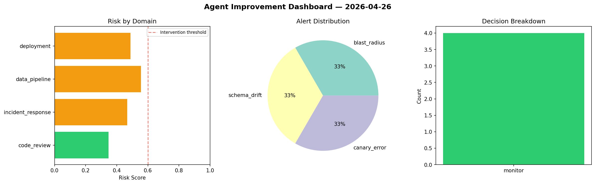
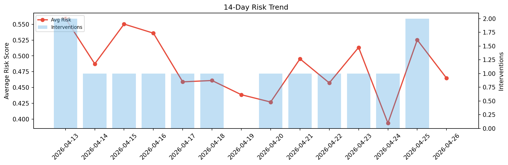

# Agent Improvement Report — 2026-04-26

**Cycle ID:** `a60b21c0` | **Avg Risk:** 0.4647 | **Interventions:** 0/4

## Risk Matrix

| Domain | Risk Score | Decision | Alerts |
|--------|-----------|----------|--------|
| code_review | 0.3475 | monitor | none |
| incident_response | 0.4676 | monitor | blast_radius |
| data_pipeline | 0.5561 | monitor | schema_drift |
| deployment | 0.4878 | monitor | canary_error |

## Delta vs Yesterday

| Domain | Today | Yesterday | Change |
|--------|-------|-----------|--------|
| code_review | 0.3475 | 0.4513 | 📉 -23.0% |
| incident_response | 0.4676 | 0.6719 | 📉 -30.4% |
| data_pipeline | 0.5561 | 0.6323 | 📉 -12.1% |
| deployment | 0.4878 | 0.3463 | 📈 40.9% |

**Refinement:** `{'adjustment': 'tighten_thresholds', 'trend': 'degrading', 'window': 4}`