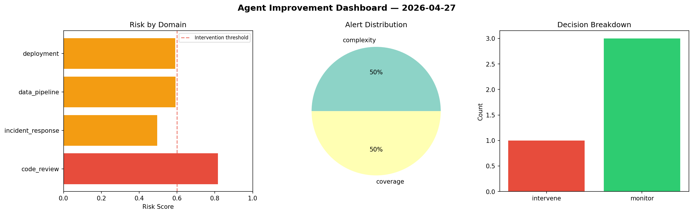
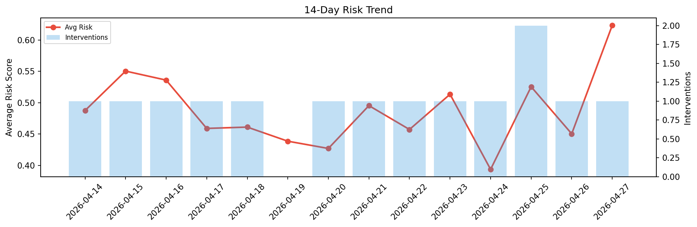

# Agent Improvement Report — 2026-04-27

**Cycle ID:** `8ff40fac` | **Avg Risk:** 0.6235 | **Interventions:** 1/4

## Risk Matrix

| Domain | Risk Score | Decision | Alerts |
|--------|-----------|----------|--------|
| code_review | 0.8166 | intervene | complexity, coverage |
| incident_response | 0.4959 | monitor | none |
| data_pipeline | 0.5913 | monitor | none |
| deployment | 0.5902 | monitor | none |

## Delta vs Yesterday

| Domain | Today | Yesterday | Change |
|--------|-------|-----------|--------|
| code_review | 0.8166 | 0.351 | 📈 132.6% |
| incident_response | 0.4959 | 0.3048 | 📈 62.7% |
| data_pipeline | 0.5913 | 0.5046 | 📈 17.2% |
| deployment | 0.5902 | 0.6406 | 📉 -7.9% |

**Refinement:** `{'adjustment': 'maintain', 'trend': 'improving', 'window': 4}`