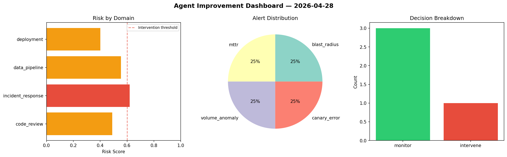
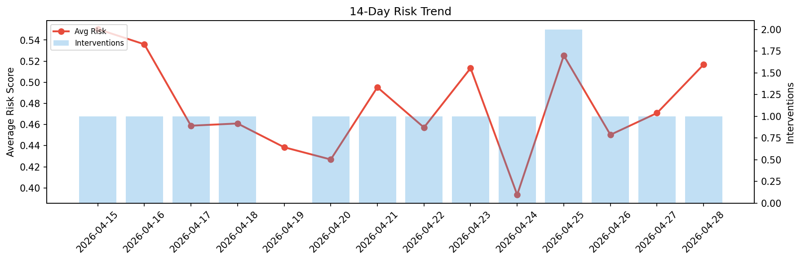

# Agent Improvement Report — 2026-04-28

**Cycle ID:** `f352fb40` | **Avg Risk:** 0.5168 | **Interventions:** 1/4

## Risk Matrix

| Domain | Risk Score | Decision | Alerts |
|--------|-----------|----------|--------|
| code_review | 0.4902 | monitor | none |
| incident_response | 0.6201 | intervene | blast_radius, mttr |
| data_pipeline | 0.5552 | monitor | volume_anomaly |
| deployment | 0.4015 | monitor | canary_error |

## Delta vs Yesterday

| Domain | Today | Yesterday | Change |
|--------|-------|-----------|--------|
| code_review | 0.4902 | 0.7498 | 📉 -34.6% |
| incident_response | 0.6201 | 0.295 | 📈 110.2% |
| data_pipeline | 0.5552 | 0.3954 | 📈 40.4% |
| deployment | 0.4015 | 0.4436 | 📉 -9.5% |

**Refinement:** `{'adjustment': 'maintain', 'trend': 'improving', 'window': 4}`