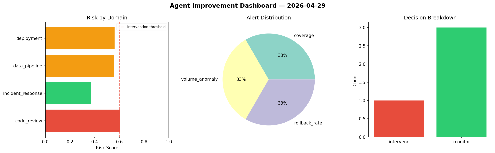
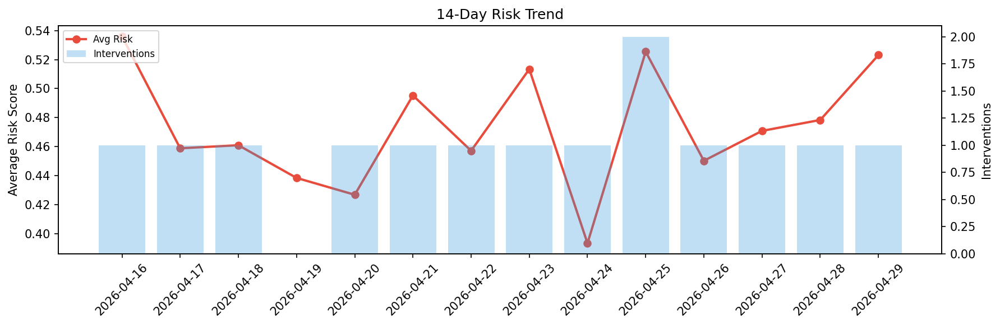

# Agent Improvement Report — 2026-04-29

**Cycle ID:** `1ca8262f` | **Avg Risk:** 0.5231 | **Interventions:** 1/4

## Risk Matrix

| Domain | Risk Score | Decision | Alerts |
|--------|-----------|----------|--------|
| code_review | 0.6077 | intervene | coverage |
| incident_response | 0.3675 | monitor | none |
| data_pipeline | 0.5559 | monitor | volume_anomaly |
| deployment | 0.5612 | monitor | rollback_rate |

## Delta vs Yesterday

| Domain | Today | Yesterday | Change |
|--------|-------|-----------|--------|
| code_review | 0.6077 | 0.7107 | 📉 -14.5% |
| incident_response | 0.3675 | 0.2454 | 📈 49.8% |
| data_pipeline | 0.5559 | 0.4738 | 📈 17.3% |
| deployment | 0.5612 | 0.4837 | 📈 16.0% |

**Refinement:** `{'adjustment': 'maintain', 'trend': 'improving', 'window': 4}`