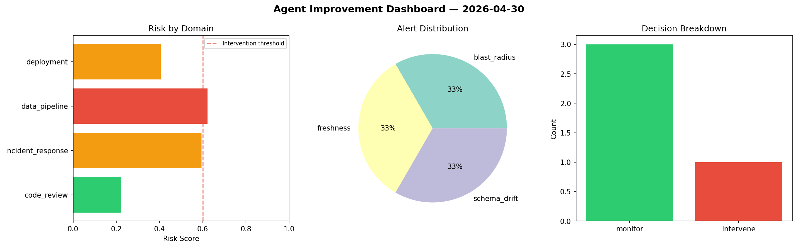
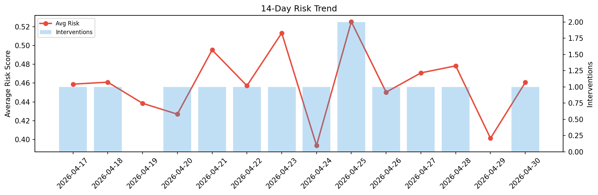

# Agent Improvement Report — 2026-04-30

**Cycle ID:** `0a20de04` | **Avg Risk:** 0.4607 | **Interventions:** 1/4

## Risk Matrix

| Domain | Risk Score | Decision | Alerts |
|--------|-----------|----------|--------|
| code_review | 0.2217 | monitor | none |
| incident_response | 0.5947 | monitor | blast_radius |
| data_pipeline | 0.6214 | intervene | freshness, schema_drift |
| deployment | 0.405 | monitor | none |

## Delta vs Yesterday

| Domain | Today | Yesterday | Change |
|--------|-------|-----------|--------|
| code_review | 0.2217 | 0.4984 | 📉 -55.5% |
| incident_response | 0.5947 | 0.4036 | 📈 47.3% |
| data_pipeline | 0.6214 | 0.3169 | 📈 96.1% |
| deployment | 0.405 | 0.3858 | 📈 5.0% |

**Refinement:** `{'adjustment': 'tighten_thresholds', 'trend': 'degrading', 'window': 4}`