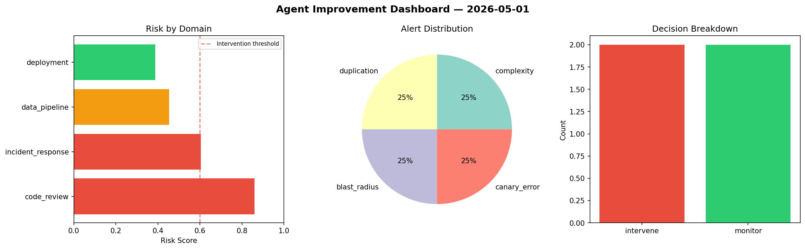
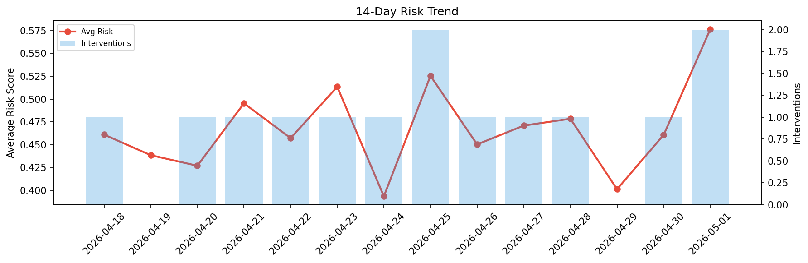

# Agent Improvement Report — 2026-05-01

**Cycle ID:** `cfea6fce` | **Avg Risk:** 0.5764 | **Interventions:** 2/4

## Risk Matrix

| Domain | Risk Score | Decision | Alerts |
|--------|-----------|----------|--------|
| code_review | 0.8594 | intervene | complexity, duplication |
| incident_response | 0.6045 | intervene | blast_radius |
| data_pipeline | 0.4533 | monitor | none |
| deployment | 0.3882 | monitor | canary_error |

## Delta vs Yesterday

| Domain | Today | Yesterday | Change |
|--------|-------|-----------|--------|
| code_review | 0.8594 | 0.2217 | 📈 287.6% |
| incident_response | 0.6045 | 0.5947 | 📈 1.6% |
| data_pipeline | 0.4533 | 0.6214 | 📉 -27.1% |
| deployment | 0.3882 | 0.405 | 📉 -4.1% |

**Refinement:** `{'adjustment': 'maintain', 'trend': 'improving', 'window': 4}`