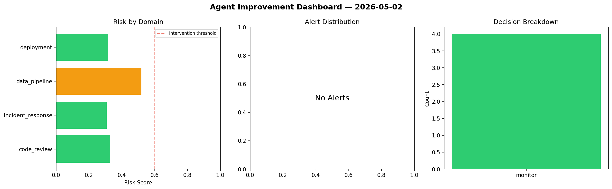
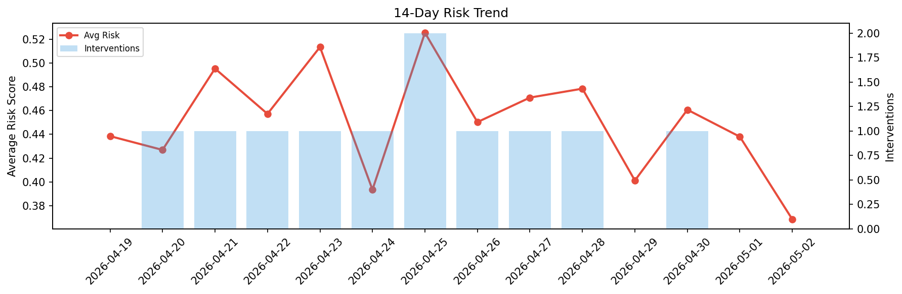

# Agent Improvement Report — 2026-05-02

**Cycle ID:** `2db48806` | **Avg Risk:** 0.3685 | **Interventions:** 0/4

## Risk Matrix

| Domain | Risk Score | Decision | Alerts |
|--------|-----------|----------|--------|
| code_review | 0.328 | monitor | none |
| incident_response | 0.3089 | monitor | none |
| data_pipeline | 0.5201 | monitor | none |
| deployment | 0.3171 | monitor | none |

## Delta vs Yesterday

| Domain | Today | Yesterday | Change |
|--------|-------|-----------|--------|
| code_review | 0.328 | 0.3934 | 📉 -16.6% |
| incident_response | 0.3089 | 0.3676 | 📉 -16.0% |
| data_pipeline | 0.5201 | 0.5424 | 📉 -4.1% |
| deployment | 0.3171 | 0.4487 | 📉 -29.3% |

**Refinement:** `{'adjustment': 'maintain', 'trend': 'improving', 'window': 4}`