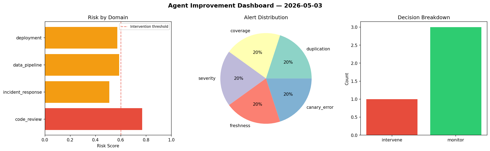
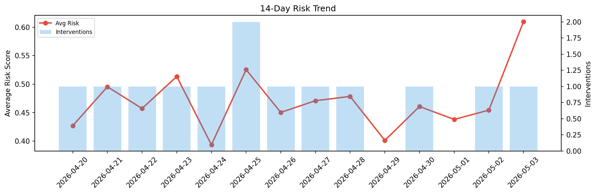

# Agent Improvement Report — 2026-05-03

**Cycle ID:** `6176e26d` | **Avg Risk:** 0.6098 | **Interventions:** 1/4

## Risk Matrix

| Domain | Risk Score | Decision | Alerts |
|--------|-----------|----------|--------|
| code_review | 0.7691 | intervene | duplication, coverage |
| incident_response | 0.5099 | monitor | severity |
| data_pipeline | 0.5876 | monitor | freshness |
| deployment | 0.5725 | monitor | canary_error |

## Delta vs Yesterday

| Domain | Today | Yesterday | Change |
|--------|-------|-----------|--------|
| code_review | 0.7691 | 0.3374 | 📈 127.9% |
| incident_response | 0.5099 | 0.2869 | 📈 77.7% |
| data_pipeline | 0.5876 | 0.4136 | 📈 42.1% |
| deployment | 0.5725 | 0.7793 | 📉 -26.5% |

**Refinement:** `{'adjustment': 'maintain', 'trend': 'improving', 'window': 4}`