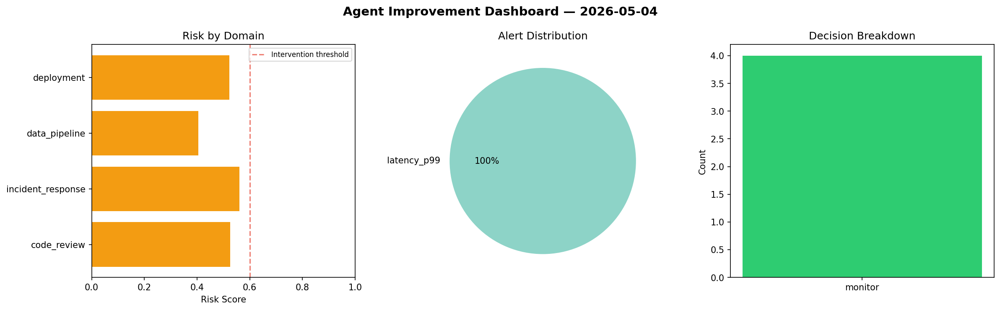
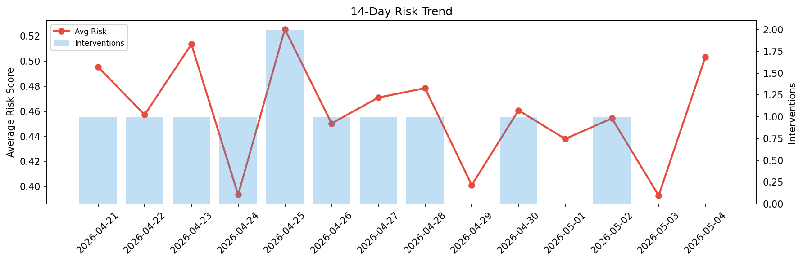

# Agent Improvement Report — 2026-05-04

**Cycle ID:** `4fb72b86` | **Avg Risk:** 0.5032 | **Interventions:** 0/4

## Risk Matrix

| Domain | Risk Score | Decision | Alerts |
|--------|-----------|----------|--------|
| code_review | 0.5255 | monitor | none |
| incident_response | 0.5606 | monitor | none |
| data_pipeline | 0.4048 | monitor | none |
| deployment | 0.5219 | monitor | latency_p99 |

## Delta vs Yesterday

| Domain | Today | Yesterday | Change |
|--------|-------|-----------|--------|
| code_review | 0.5255 | 0.3357 | 📈 56.5% |
| incident_response | 0.5606 | 0.2467 | 📈 127.2% |
| data_pipeline | 0.4048 | 0.4492 | 📉 -9.9% |
| deployment | 0.5219 | 0.5399 | 📉 -3.3% |

**Refinement:** `{'adjustment': 'maintain', 'trend': 'improving', 'window': 4}`