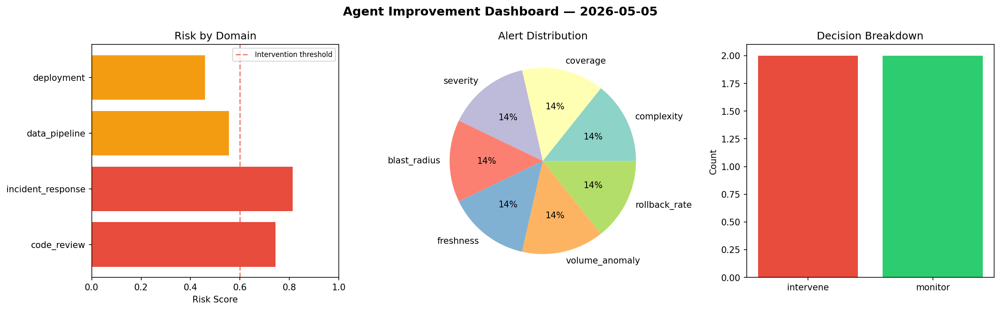
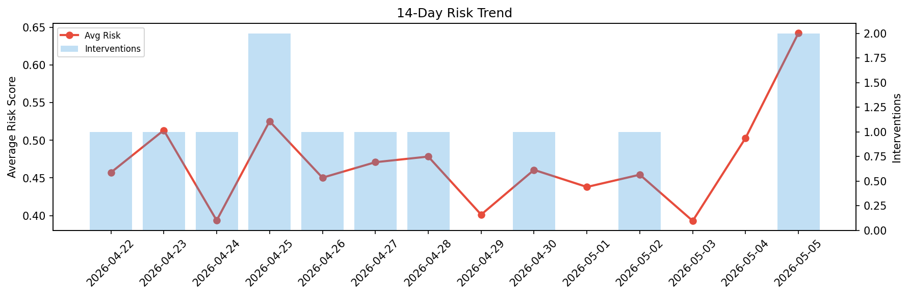

# Agent Improvement Report — 2026-05-05

**Cycle ID:** `4e9aa8cd` | **Avg Risk:** 0.6428 | **Interventions:** 2/4

## Risk Matrix

| Domain | Risk Score | Decision | Alerts |
|--------|-----------|----------|--------|
| code_review | 0.7434 | intervene | complexity, coverage |
| incident_response | 0.8135 | intervene | severity, blast_radius |
| data_pipeline | 0.5555 | monitor | freshness, volume_anomaly |
| deployment | 0.4588 | monitor | rollback_rate |

## Delta vs Yesterday

| Domain | Today | Yesterday | Change |
|--------|-------|-----------|--------|
| code_review | 0.7434 | 0.5255 | 📈 41.5% |
| incident_response | 0.8135 | 0.5606 | 📈 45.1% |
| data_pipeline | 0.5555 | 0.4048 | 📈 37.2% |
| deployment | 0.4588 | 0.5219 | 📉 -12.1% |

**Refinement:** `{'adjustment': 'maintain', 'trend': 'improving', 'window': 4}`