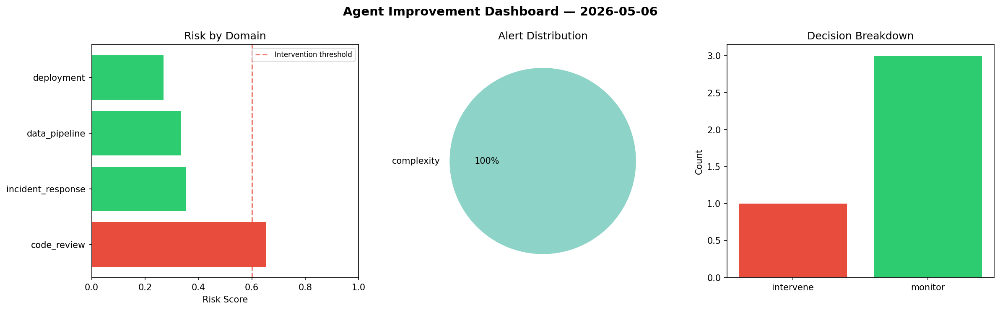
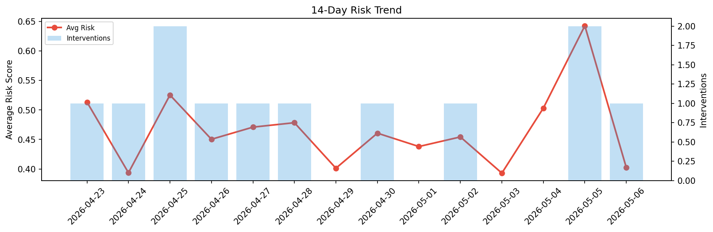

# Agent Improvement Report — 2026-05-06

**Cycle ID:** `558ad5b8` | **Avg Risk:** 0.4022 | **Interventions:** 1/4

## Risk Matrix

| Domain | Risk Score | Decision | Alerts |
|--------|-----------|----------|--------|
| code_review | 0.6533 | intervene | complexity |
| incident_response | 0.3528 | monitor | none |
| data_pipeline | 0.333 | monitor | none |
| deployment | 0.2698 | monitor | none |

## Delta vs Yesterday

| Domain | Today | Yesterday | Change |
|--------|-------|-----------|--------|
| code_review | 0.6533 | 0.7434 | 📉 -12.1% |
| incident_response | 0.3528 | 0.8135 | 📉 -56.6% |
| data_pipeline | 0.333 | 0.5555 | 📉 -40.1% |
| deployment | 0.2698 | 0.4588 | 📉 -41.2% |

**Refinement:** `{'adjustment': 'maintain', 'trend': 'improving', 'window': 4}`