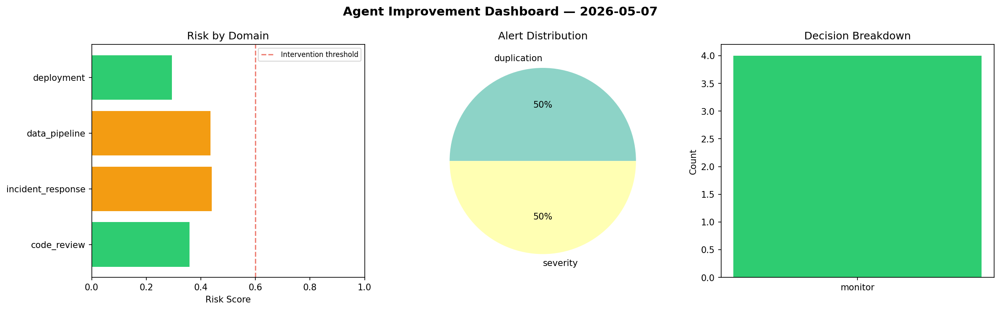
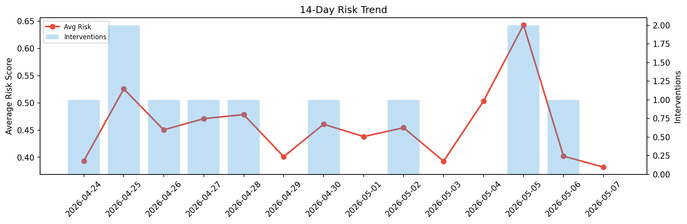

# Agent Improvement Report — 2026-05-07

**Cycle ID:** `44081162` | **Avg Risk:** 0.382 | **Interventions:** 0/4

## Risk Matrix

| Domain | Risk Score | Decision | Alerts |
|--------|-----------|----------|--------|
| code_review | 0.3578 | monitor | duplication |
| incident_response | 0.4398 | monitor | severity |
| data_pipeline | 0.4359 | monitor | none |
| deployment | 0.2943 | monitor | none |

## Delta vs Yesterday

| Domain | Today | Yesterday | Change |
|--------|-------|-----------|--------|
| code_review | 0.3578 | 0.6533 | 📉 -45.2% |
| incident_response | 0.4398 | 0.3528 | 📈 24.7% |
| data_pipeline | 0.4359 | 0.333 | 📈 30.9% |
| deployment | 0.2943 | 0.2698 | 📈 9.1% |

**Refinement:** `{'adjustment': 'maintain', 'trend': 'improving', 'window': 4}`