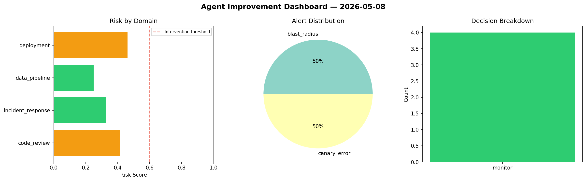
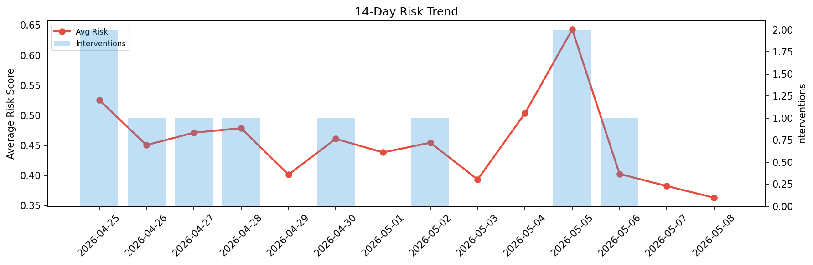

# Agent Improvement Report — 2026-05-08

**Cycle ID:** `2c2d2932` | **Avg Risk:** 0.3626 | **Interventions:** 0/4

## Risk Matrix

| Domain | Risk Score | Decision | Alerts |
|--------|-----------|----------|--------|
| code_review | 0.4144 | monitor | none |
| incident_response | 0.3257 | monitor | blast_radius |
| data_pipeline | 0.249 | monitor | none |
| deployment | 0.4614 | monitor | canary_error |

## Delta vs Yesterday

| Domain | Today | Yesterday | Change |
|--------|-------|-----------|--------|
| code_review | 0.4144 | 0.3578 | 📈 15.8% |
| incident_response | 0.3257 | 0.4398 | 📉 -25.9% |
| data_pipeline | 0.249 | 0.4359 | 📉 -42.9% |
| deployment | 0.4614 | 0.2943 | 📈 56.8% |

**Refinement:** `{'adjustment': 'tighten_thresholds', 'trend': 'degrading', 'window': 4}`