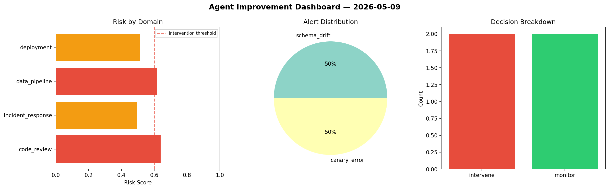
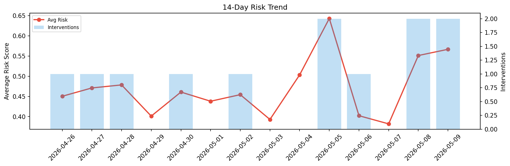

# Agent Improvement Report — 2026-05-09

**Cycle ID:** `eab14598` | **Avg Risk:** 0.5665 | **Interventions:** 2/4

## Risk Matrix

| Domain | Risk Score | Decision | Alerts |
|--------|-----------|----------|--------|
| code_review | 0.6396 | intervene | none |
| incident_response | 0.4942 | monitor | none |
| data_pipeline | 0.6173 | intervene | schema_drift |
| deployment | 0.5151 | monitor | canary_error |

## Delta vs Yesterday

| Domain | Today | Yesterday | Change |
|--------|-------|-----------|--------|
| code_review | 0.6396 | 0.64 | 📉 -0.1% |
| incident_response | 0.4942 | 0.6748 | 📉 -26.8% |
| data_pipeline | 0.6173 | 0.4493 | 📈 37.4% |
| deployment | 0.5151 | 0.4404 | 📈 17.0% |

**Refinement:** `{'adjustment': 'maintain', 'trend': 'improving', 'window': 4}`