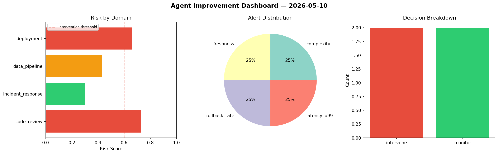
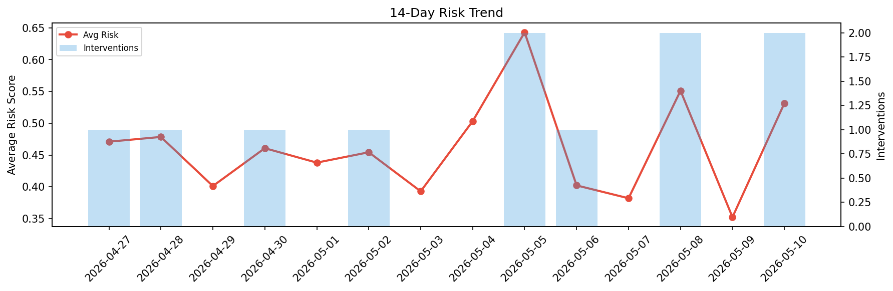

# Agent Improvement Report — 2026-05-10

**Cycle ID:** `f528176f` | **Avg Risk:** 0.5315 | **Interventions:** 2/4

## Risk Matrix

| Domain | Risk Score | Decision | Alerts |
|--------|-----------|----------|--------|
| code_review | 0.7292 | intervene | complexity |
| incident_response | 0.3009 | monitor | none |
| data_pipeline | 0.4336 | monitor | freshness |
| deployment | 0.6625 | intervene | rollback_rate, latency_p99 |

## Delta vs Yesterday

| Domain | Today | Yesterday | Change |
|--------|-------|-----------|--------|
| code_review | 0.7292 | 0.1952 | 📈 273.6% |
| incident_response | 0.3009 | 0.3144 | 📉 -4.3% |
| data_pipeline | 0.4336 | 0.5098 | 📉 -14.9% |
| deployment | 0.6625 | 0.3897 | 📈 70.0% |

**Refinement:** `{'adjustment': 'maintain', 'trend': 'improving', 'window': 4}`