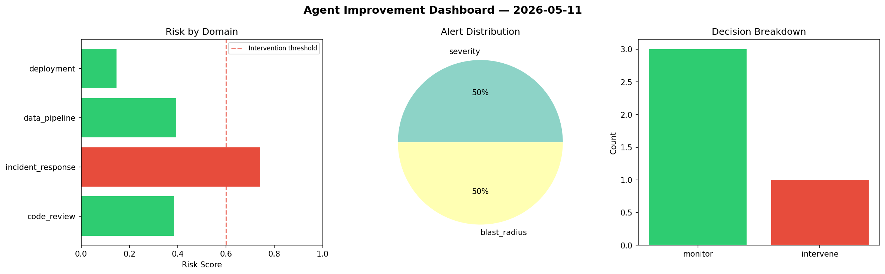
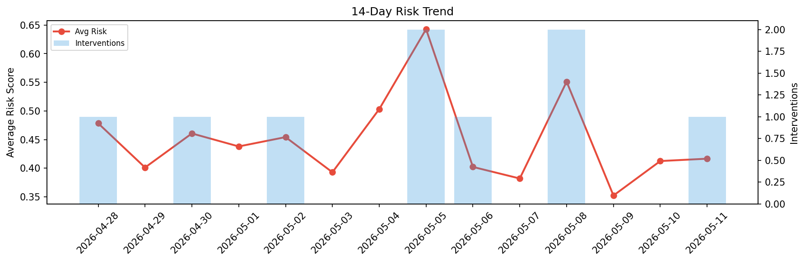

# Agent Improvement Report — 2026-05-11

**Cycle ID:** `867232e9` | **Avg Risk:** 0.4166 | **Interventions:** 1/4

## Risk Matrix

| Domain | Risk Score | Decision | Alerts |
|--------|-----------|----------|--------|
| code_review | 0.3851 | monitor | none |
| incident_response | 0.7416 | intervene | severity, blast_radius |
| data_pipeline | 0.394 | monitor | none |
| deployment | 0.1458 | monitor | none |

## Delta vs Yesterday

| Domain | Today | Yesterday | Change |
|--------|-------|-----------|--------|
| code_review | 0.3851 | 0.3513 | 📈 9.6% |
| incident_response | 0.7416 | 0.4754 | 📈 56.0% |
| data_pipeline | 0.394 | 0.5494 | 📉 -28.3% |
| deployment | 0.1458 | 0.2738 | 📉 -46.7% |

**Refinement:** `{'adjustment': 'maintain', 'trend': 'improving', 'window': 4}`