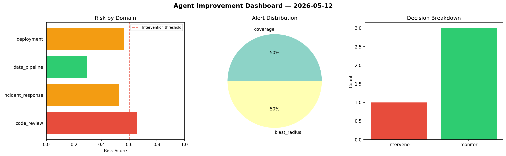
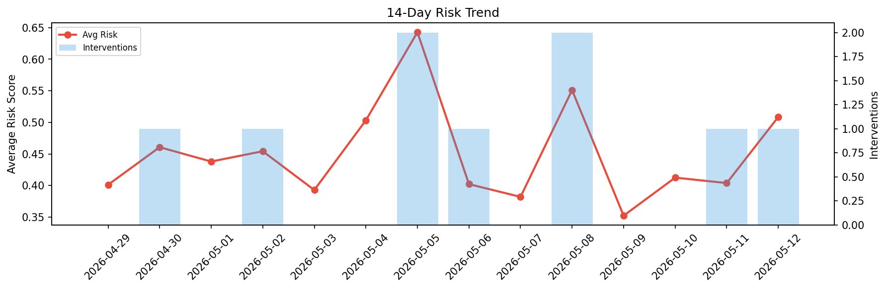

# Agent Improvement Report — 2026-05-12

**Cycle ID:** `ed7053ab` | **Avg Risk:** 0.5086 | **Interventions:** 1/4

## Risk Matrix

| Domain | Risk Score | Decision | Alerts |
|--------|-----------|----------|--------|
| code_review | 0.6548 | intervene | coverage |
| incident_response | 0.5238 | monitor | blast_radius |
| data_pipeline | 0.2958 | monitor | none |
| deployment | 0.56 | monitor | none |

## Delta vs Yesterday

| Domain | Today | Yesterday | Change |
|--------|-------|-----------|--------|
| code_review | 0.6548 | 0.773 | 📉 -15.3% |
| incident_response | 0.5238 | 0.2018 | 📈 159.6% |
| data_pipeline | 0.2958 | 0.3561 | 📉 -16.9% |
| deployment | 0.56 | 0.2846 | 📈 96.8% |

**Refinement:** `{'adjustment': 'maintain', 'trend': 'improving', 'window': 4}`