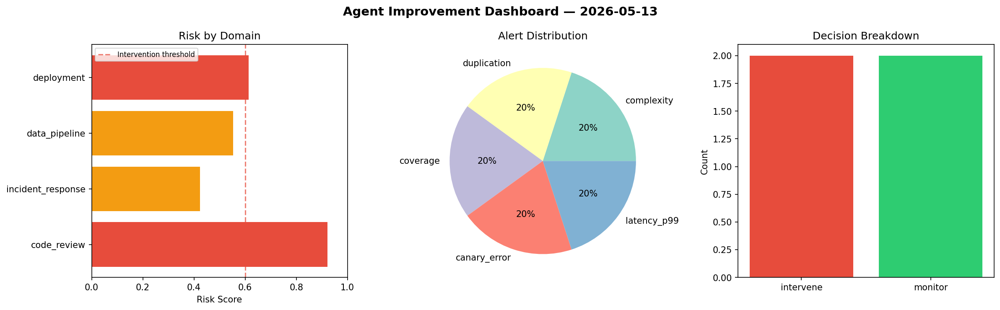
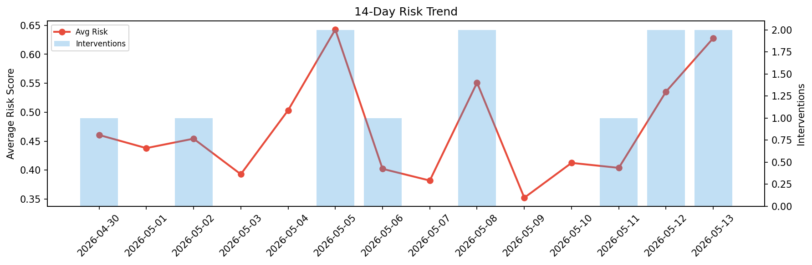

# Agent Improvement Report — 2026-05-13

**Cycle ID:** `8df85daa` | **Avg Risk:** 0.628 | **Interventions:** 2/4

## Risk Matrix

| Domain | Risk Score | Decision | Alerts |
|--------|-----------|----------|--------|
| code_review | 0.9217 | intervene | complexity, duplication, coverage |
| incident_response | 0.4229 | monitor | none |
| data_pipeline | 0.5537 | monitor | none |
| deployment | 0.6136 | intervene | canary_error, latency_p99 |

## Delta vs Yesterday

| Domain | Today | Yesterday | Change |
|--------|-------|-----------|--------|
| code_review | 0.9217 | 0.4849 | 📈 90.1% |
| incident_response | 0.4229 | 0.7758 | 📉 -45.5% |
| data_pipeline | 0.5537 | 0.6388 | 📉 -13.3% |
| deployment | 0.6136 | 0.2431 | 📈 152.4% |

**Refinement:** `{'adjustment': 'maintain', 'trend': 'improving', 'window': 4}`