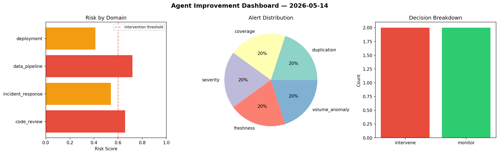
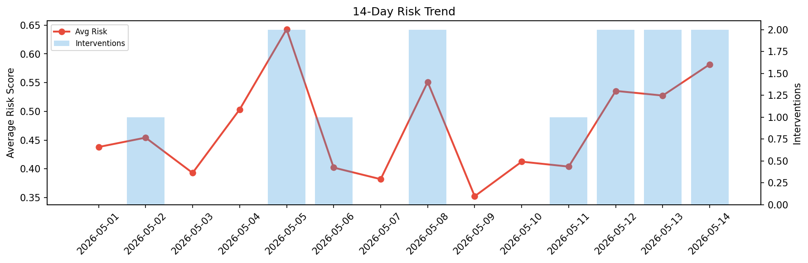

# Agent Improvement Report — 2026-05-14

**Cycle ID:** `f2e4488e` | **Avg Risk:** 0.5819 | **Interventions:** 2/4

## Risk Matrix

| Domain | Risk Score | Decision | Alerts |
|--------|-----------|----------|--------|
| code_review | 0.658 | intervene | duplication, coverage |
| incident_response | 0.5401 | monitor | severity |
| data_pipeline | 0.7182 | intervene | freshness, volume_anomaly |
| deployment | 0.4115 | monitor | none |

## Delta vs Yesterday

| Domain | Today | Yesterday | Change |
|--------|-------|-----------|--------|
| code_review | 0.658 | 0.6106 | 📈 7.8% |
| incident_response | 0.5401 | 0.4077 | 📈 32.5% |
| data_pipeline | 0.7182 | 0.7772 | 📉 -7.6% |
| deployment | 0.4115 | 0.3144 | 📈 30.9% |

**Refinement:** `{'adjustment': 'maintain', 'trend': 'improving', 'window': 4}`