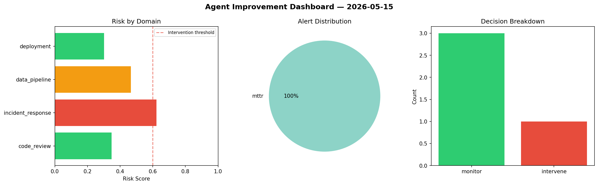
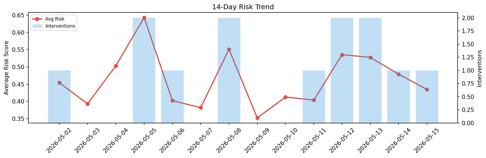

# Agent Improvement Report — 2026-05-15

**Cycle ID:** `cd709a19` | **Avg Risk:** 0.4347 | **Interventions:** 1/4

## Risk Matrix

| Domain | Risk Score | Decision | Alerts |
|--------|-----------|----------|--------|
| code_review | 0.3478 | monitor | none |
| incident_response | 0.6234 | intervene | mttr |
| data_pipeline | 0.466 | monitor | none |
| deployment | 0.3017 | monitor | none |

## Delta vs Yesterday

| Domain | Today | Yesterday | Change |
|--------|-------|-----------|--------|
| code_review | 0.3478 | 0.4569 | 📉 -23.9% |
| incident_response | 0.6234 | 0.4445 | 📈 40.2% |
| data_pipeline | 0.466 | 0.3534 | 📈 31.9% |
| deployment | 0.3017 | 0.6607 | 📉 -54.3% |

**Refinement:** `{'adjustment': 'maintain', 'trend': 'improving', 'window': 4}`