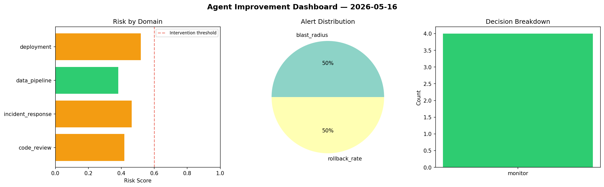
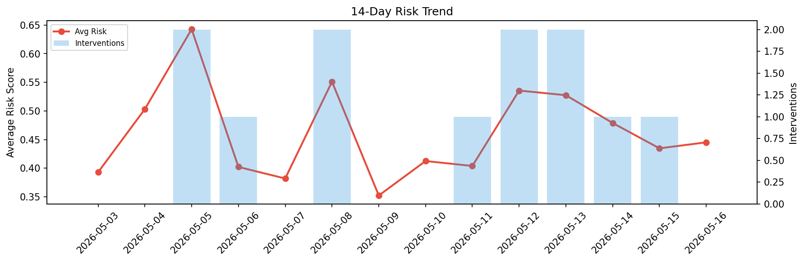

# Agent Improvement Report — 2026-05-16

**Cycle ID:** `949c3e53` | **Avg Risk:** 0.4452 | **Interventions:** 0/4

## Risk Matrix

| Domain | Risk Score | Decision | Alerts |
|--------|-----------|----------|--------|
| code_review | 0.4186 | monitor | none |
| incident_response | 0.463 | monitor | blast_radius |
| data_pipeline | 0.3809 | monitor | none |
| deployment | 0.5183 | monitor | rollback_rate |

## Delta vs Yesterday

| Domain | Today | Yesterday | Change |
|--------|-------|-----------|--------|
| code_review | 0.4186 | 0.3478 | 📈 20.4% |
| incident_response | 0.463 | 0.6234 | 📉 -25.7% |
| data_pipeline | 0.3809 | 0.466 | 📉 -18.3% |
| deployment | 0.5183 | 0.3017 | 📈 71.8% |

**Refinement:** `{'adjustment': 'tighten_thresholds', 'trend': 'degrading', 'window': 4}`