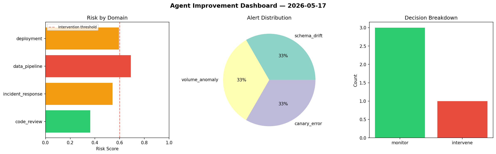
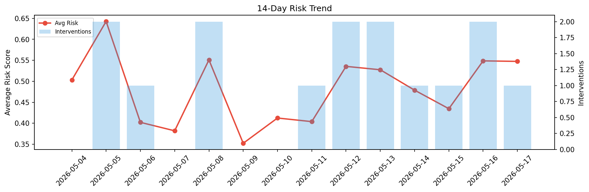

# Agent Improvement Report — 2026-05-17

**Cycle ID:** `b50f6fca` | **Avg Risk:** 0.5475 | **Interventions:** 1/4

## Risk Matrix

| Domain | Risk Score | Decision | Alerts |
|--------|-----------|----------|--------|
| code_review | 0.3619 | monitor | none |
| incident_response | 0.5428 | monitor | none |
| data_pipeline | 0.6905 | intervene | schema_drift, volume_anomaly |
| deployment | 0.5948 | monitor | canary_error |

## Delta vs Yesterday

| Domain | Today | Yesterday | Change |
|--------|-------|-----------|--------|
| code_review | 0.3619 | 0.4496 | 📉 -19.5% |
| incident_response | 0.5428 | 0.6614 | 📉 -17.9% |
| data_pipeline | 0.6905 | 0.6726 | 📈 2.7% |
| deployment | 0.5948 | 0.4112 | 📈 44.6% |

**Refinement:** `{'adjustment': 'tighten_thresholds', 'trend': 'degrading', 'window': 4}`