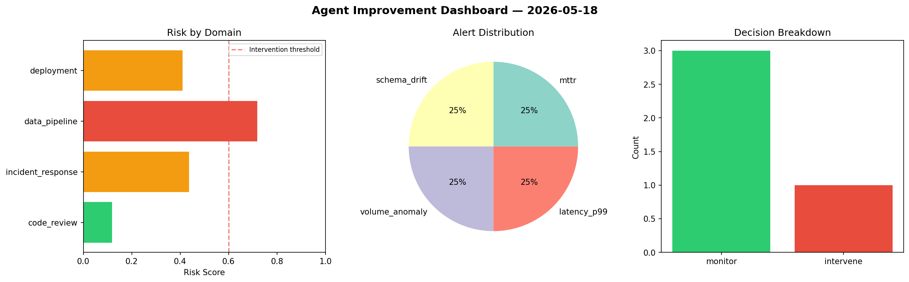
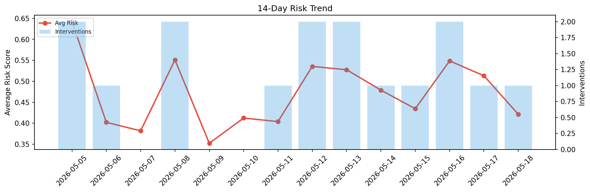

# Agent Improvement Report — 2026-05-18

**Cycle ID:** `5bbda53b` | **Avg Risk:** 0.4213 | **Interventions:** 1/4

## Risk Matrix

| Domain | Risk Score | Decision | Alerts |
|--------|-----------|----------|--------|
| code_review | 0.1194 | monitor | none |
| incident_response | 0.4374 | monitor | mttr |
| data_pipeline | 0.7192 | intervene | schema_drift, volume_anomaly |
| deployment | 0.4094 | monitor | latency_p99 |

## Delta vs Yesterday

| Domain | Today | Yesterday | Change |
|--------|-------|-----------|--------|
| code_review | 0.1194 | 0.3529 | 📉 -66.2% |
| incident_response | 0.4374 | 0.5117 | 📉 -14.5% |
| data_pipeline | 0.7192 | 0.4435 | 📈 62.2% |
| deployment | 0.4094 | 0.7447 | 📉 -45.0% |

**Refinement:** `{'adjustment': 'tighten_thresholds', 'trend': 'degrading', 'window': 4}`