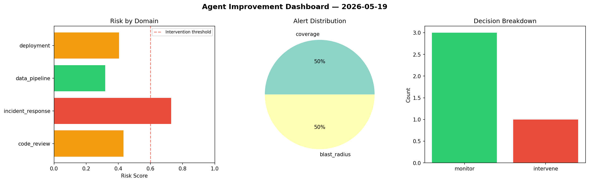
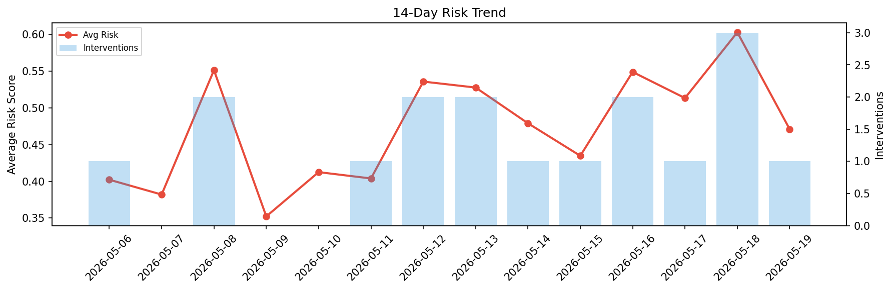

# Agent Improvement Report — 2026-05-19

**Cycle ID:** `cc0cb47d` | **Avg Risk:** 0.4709 | **Interventions:** 1/4

## Risk Matrix

| Domain | Risk Score | Decision | Alerts |
|--------|-----------|----------|--------|
| code_review | 0.4321 | monitor | coverage |
| incident_response | 0.7283 | intervene | blast_radius |
| data_pipeline | 0.319 | monitor | none |
| deployment | 0.4044 | monitor | none |

## Delta vs Yesterday

| Domain | Today | Yesterday | Change |
|--------|-------|-----------|--------|
| code_review | 0.4321 | 0.6241 | 📉 -30.8% |
| incident_response | 0.7283 | 0.6423 | 📈 13.4% |
| data_pipeline | 0.319 | 0.4305 | 📉 -25.9% |
| deployment | 0.4044 | 0.7134 | 📉 -43.3% |

**Refinement:** `{'adjustment': 'maintain', 'trend': 'improving', 'window': 4}`