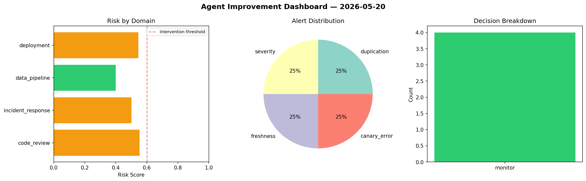
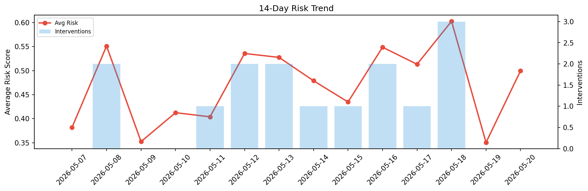

# Agent Improvement Report — 2026-05-20

**Cycle ID:** `640a6e6d` | **Avg Risk:** 0.4997 | **Interventions:** 0/4

## Risk Matrix

| Domain | Risk Score | Decision | Alerts |
|--------|-----------|----------|--------|
| code_review | 0.5539 | monitor | duplication |
| incident_response | 0.5005 | monitor | severity |
| data_pipeline | 0.3994 | monitor | freshness |
| deployment | 0.5451 | monitor | canary_error |

## Delta vs Yesterday

| Domain | Today | Yesterday | Change |
|--------|-------|-----------|--------|
| code_review | 0.5539 | 0.3198 | 📈 73.2% |
| incident_response | 0.5005 | 0.2267 | 📈 120.8% |
| data_pipeline | 0.3994 | 0.2876 | 📈 38.9% |
| deployment | 0.5451 | 0.5674 | 📉 -3.9% |

**Refinement:** `{'adjustment': 'maintain', 'trend': 'improving', 'window': 4}`