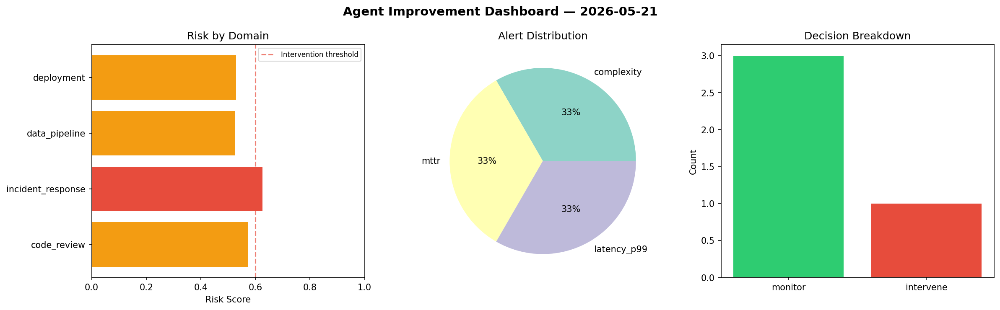
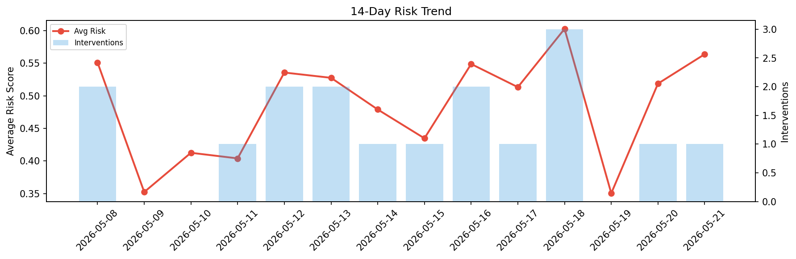

# Agent Improvement Report — 2026-05-21

**Cycle ID:** `0511800d` | **Avg Risk:** 0.5637 | **Interventions:** 1/4

## Risk Matrix

| Domain | Risk Score | Decision | Alerts |
|--------|-----------|----------|--------|
| code_review | 0.5743 | monitor | complexity |
| incident_response | 0.6254 | intervene | mttr |
| data_pipeline | 0.5257 | monitor | none |
| deployment | 0.5294 | monitor | latency_p99 |

## Delta vs Yesterday

| Domain | Today | Yesterday | Change |
|--------|-------|-----------|--------|
| code_review | 0.5743 | 0.5368 | 📈 7.0% |
| incident_response | 0.6254 | 0.3863 | 📈 61.9% |
| data_pipeline | 0.5257 | 0.7128 | 📉 -26.2% |
| deployment | 0.5294 | 0.4385 | 📈 20.7% |

**Refinement:** `{'adjustment': 'maintain', 'trend': 'improving', 'window': 4}`