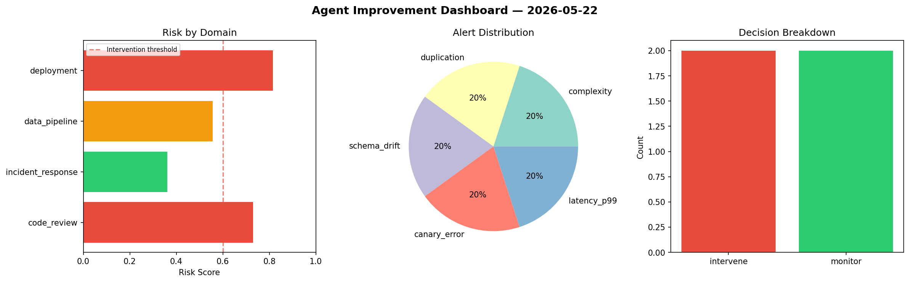
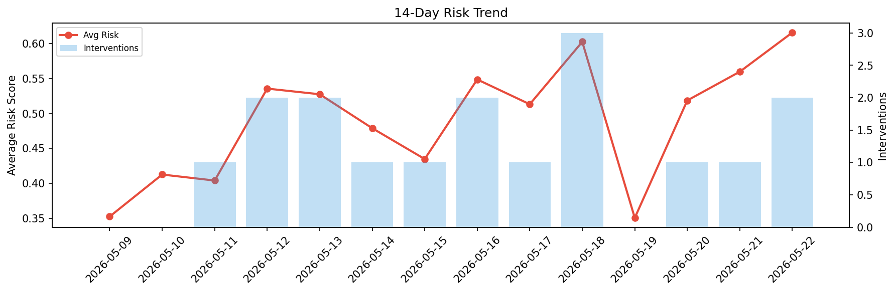

# Agent Improvement Report — 2026-05-22

**Cycle ID:** `636fe31b` | **Avg Risk:** 0.6159 | **Interventions:** 2/4

## Risk Matrix

| Domain | Risk Score | Decision | Alerts |
|--------|-----------|----------|--------|
| code_review | 0.7308 | intervene | complexity, duplication |
| incident_response | 0.3612 | monitor | none |
| data_pipeline | 0.5562 | monitor | schema_drift |
| deployment | 0.8152 | intervene | canary_error, latency_p99 |

## Delta vs Yesterday

| Domain | Today | Yesterday | Change |
|--------|-------|-----------|--------|
| code_review | 0.7308 | 0.6801 | 📈 7.5% |
| incident_response | 0.3612 | 0.4893 | 📉 -26.2% |
| data_pipeline | 0.5562 | 0.5977 | 📉 -6.9% |
| deployment | 0.8152 | 0.4721 | 📈 72.7% |

**Refinement:** `{'adjustment': 'tighten_thresholds', 'trend': 'degrading', 'window': 4}`