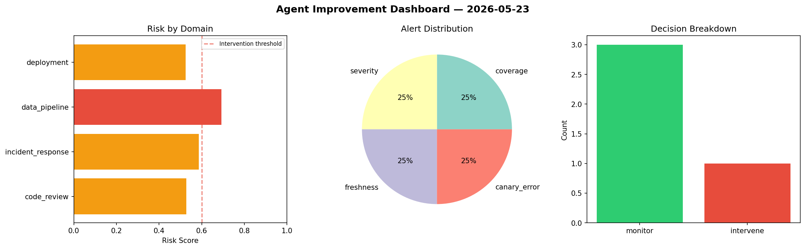
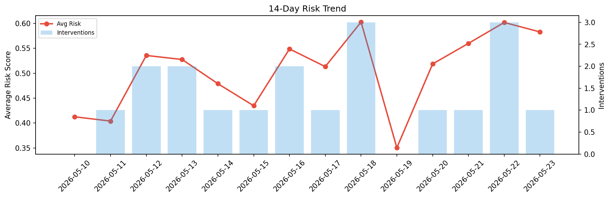

# Agent Improvement Report — 2026-05-23

**Cycle ID:** `099c6282` | **Avg Risk:** 0.5828 | **Interventions:** 1/4

## Risk Matrix

| Domain | Risk Score | Decision | Alerts |
|--------|-----------|----------|--------|
| code_review | 0.528 | monitor | coverage |
| incident_response | 0.5862 | monitor | severity |
| data_pipeline | 0.6921 | intervene | freshness |
| deployment | 0.5248 | monitor | canary_error |

## Delta vs Yesterday

| Domain | Today | Yesterday | Change |
|--------|-------|-----------|--------|
| code_review | 0.528 | 0.4654 | 📈 13.5% |
| incident_response | 0.5862 | 0.6347 | 📉 -7.6% |
| data_pipeline | 0.6921 | 0.6149 | 📈 12.6% |
| deployment | 0.5248 | 0.6922 | 📉 -24.2% |

**Refinement:** `{'adjustment': 'maintain', 'trend': 'improving', 'window': 4}`