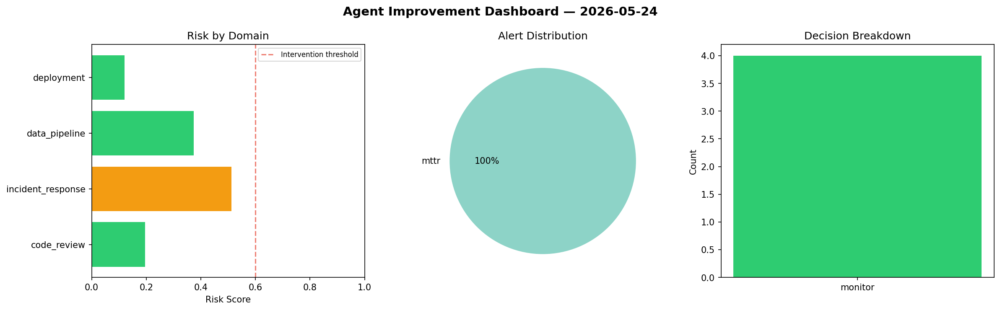
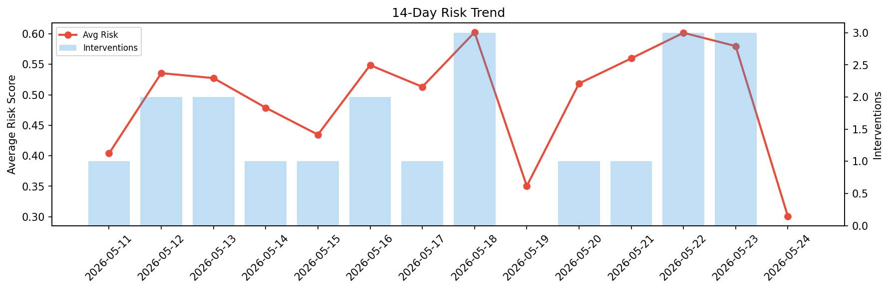

# Agent Improvement Report — 2026-05-24

**Cycle ID:** `82078812` | **Avg Risk:** 0.3006 | **Interventions:** 0/4

## Risk Matrix

| Domain | Risk Score | Decision | Alerts |
|--------|-----------|----------|--------|
| code_review | 0.1951 | monitor | none |
| incident_response | 0.5118 | monitor | mttr |
| data_pipeline | 0.3745 | monitor | none |
| deployment | 0.1211 | monitor | none |

## Delta vs Yesterday

| Domain | Today | Yesterday | Change |
|--------|-------|-----------|--------|
| code_review | 0.1951 | 0.38 | 📉 -48.7% |
| incident_response | 0.5118 | 0.6943 | 📉 -26.3% |
| data_pipeline | 0.3745 | 0.6076 | 📉 -38.4% |
| deployment | 0.1211 | 0.6382 | 📉 -81.0% |

**Refinement:** `{'adjustment': 'maintain', 'trend': 'improving', 'window': 4}`