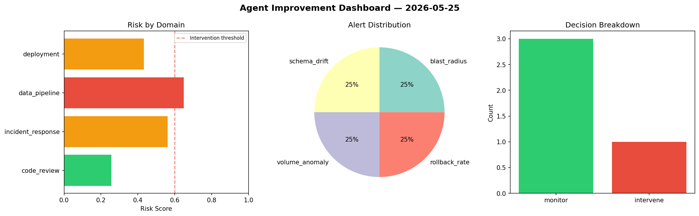
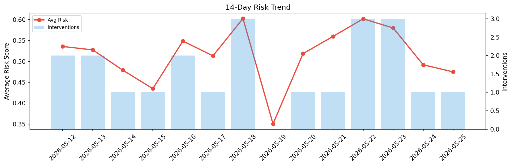

# Agent Improvement Report — 2026-05-25

**Cycle ID:** `4e33ecfa` | **Avg Risk:** 0.4748 | **Interventions:** 1/4

## Risk Matrix

| Domain | Risk Score | Decision | Alerts |
|--------|-----------|----------|--------|
| code_review | 0.2567 | monitor | none |
| incident_response | 0.5615 | monitor | blast_radius |
| data_pipeline | 0.6482 | intervene | schema_drift, volume_anomaly |
| deployment | 0.4326 | monitor | rollback_rate |

## Delta vs Yesterday

| Domain | Today | Yesterday | Change |
|--------|-------|-----------|--------|
| code_review | 0.2567 | 0.4208 | 📉 -39.0% |
| incident_response | 0.5615 | 0.437 | 📈 28.5% |
| data_pipeline | 0.6482 | 0.3506 | 📈 84.9% |
| deployment | 0.4326 | 0.7588 | 📉 -43.0% |

**Refinement:** `{'adjustment': 'tighten_thresholds', 'trend': 'degrading', 'window': 4}`