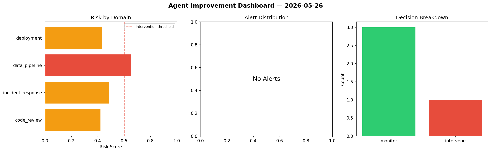
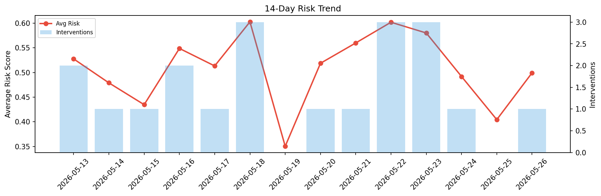

# Agent Improvement Report — 2026-05-26

**Cycle ID:** `baddda8e` | **Avg Risk:** 0.4992 | **Interventions:** 1/4

## Risk Matrix

| Domain | Risk Score | Decision | Alerts |
|--------|-----------|----------|--------|
| code_review | 0.4213 | monitor | none |
| incident_response | 0.4854 | monitor | none |
| data_pipeline | 0.6549 | intervene | none |
| deployment | 0.4353 | monitor | none |

## Delta vs Yesterday

| Domain | Today | Yesterday | Change |
|--------|-------|-----------|--------|
| code_review | 0.4213 | 0.1875 | 📈 124.7% |
| incident_response | 0.4854 | 0.507 | 📉 -4.3% |
| data_pipeline | 0.6549 | 0.3253 | 📈 101.3% |
| deployment | 0.4353 | 0.5979 | 📉 -27.2% |

**Refinement:** `{'adjustment': 'tighten_thresholds', 'trend': 'degrading', 'window': 4}`