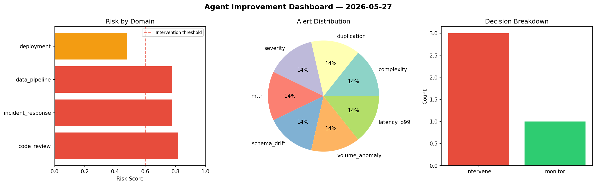
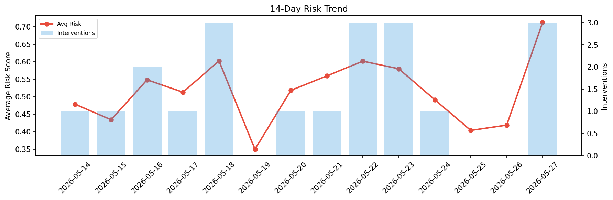

# Agent Improvement Report — 2026-05-27

**Cycle ID:** `ec4ed8fc` | **Avg Risk:** 0.7129 | **Interventions:** 3/4

## Risk Matrix

| Domain | Risk Score | Decision | Alerts |
|--------|-----------|----------|--------|
| code_review | 0.8162 | intervene | complexity, duplication |
| incident_response | 0.7781 | intervene | severity, mttr |
| data_pipeline | 0.7768 | intervene | schema_drift, volume_anomaly |
| deployment | 0.4804 | monitor | latency_p99 |

## Delta vs Yesterday

| Domain | Today | Yesterday | Change |
|--------|-------|-----------|--------|
| code_review | 0.8162 | 0.3239 | 📈 152.0% |
| incident_response | 0.7781 | 0.4738 | 📈 64.2% |
| data_pipeline | 0.7768 | 0.4473 | 📈 73.7% |
| deployment | 0.4804 | 0.4325 | 📈 11.1% |

**Refinement:** `{'adjustment': 'maintain', 'trend': 'improving', 'window': 4}`