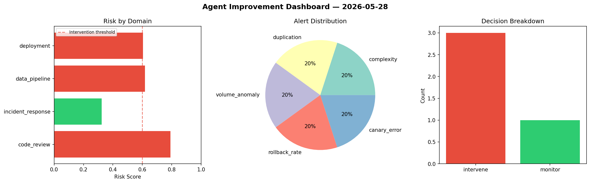
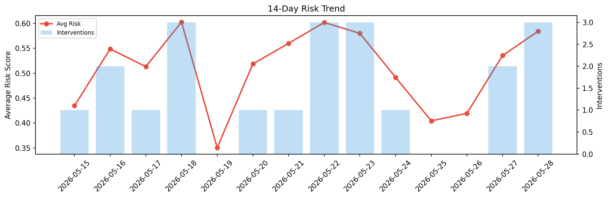

# Agent Improvement Report — 2026-05-28

**Cycle ID:** `dd5a4162` | **Avg Risk:** 0.5842 | **Interventions:** 3/4

## Risk Matrix

| Domain | Risk Score | Decision | Alerts |
|--------|-----------|----------|--------|
| code_review | 0.7917 | intervene | complexity, duplication |
| incident_response | 0.3234 | monitor | none |
| data_pipeline | 0.6181 | intervene | volume_anomaly |
| deployment | 0.6036 | intervene | rollback_rate, canary_error |

## Delta vs Yesterday

| Domain | Today | Yesterday | Change |
|--------|-------|-----------|--------|
| code_review | 0.7917 | 0.3405 | 📈 132.5% |
| incident_response | 0.3234 | 0.8258 | 📉 -60.8% |
| data_pipeline | 0.6181 | 0.3604 | 📈 71.5% |
| deployment | 0.6036 | 0.6157 | 📉 -2.0% |

**Refinement:** `{'adjustment': 'maintain', 'trend': 'improving', 'window': 4}`