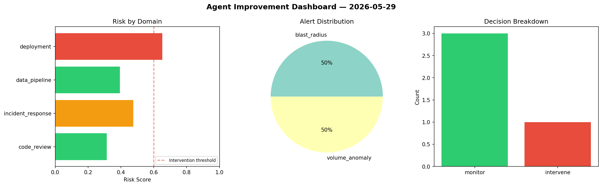
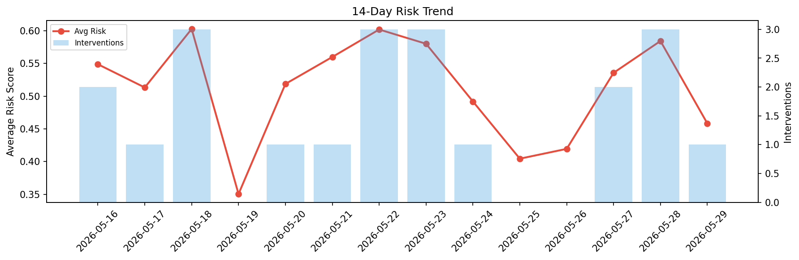

# Agent Improvement Report — 2026-05-29

**Cycle ID:** `a1ac9b36` | **Avg Risk:** 0.4583 | **Interventions:** 1/4

## Risk Matrix

| Domain | Risk Score | Decision | Alerts |
|--------|-----------|----------|--------|
| code_review | 0.3133 | monitor | none |
| incident_response | 0.4748 | monitor | blast_radius |
| data_pipeline | 0.3931 | monitor | volume_anomaly |
| deployment | 0.6518 | intervene | none |

## Delta vs Yesterday

| Domain | Today | Yesterday | Change |
|--------|-------|-----------|--------|
| code_review | 0.3133 | 0.7917 | 📉 -60.4% |
| incident_response | 0.4748 | 0.3234 | 📈 46.8% |
| data_pipeline | 0.3931 | 0.6181 | 📉 -36.4% |
| deployment | 0.6518 | 0.6036 | 📈 8.0% |

**Refinement:** `{'adjustment': 'tighten_thresholds', 'trend': 'degrading', 'window': 4}`