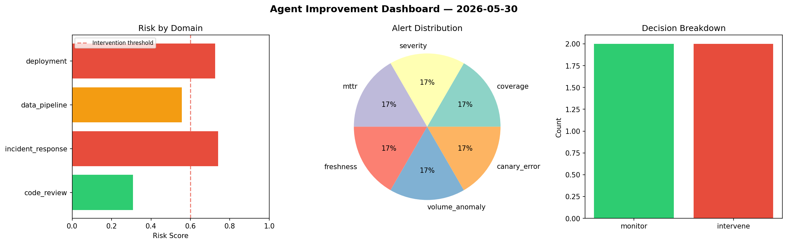
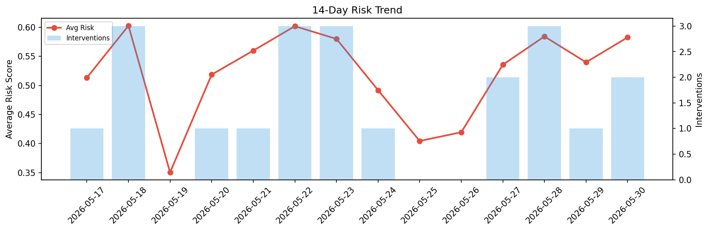

# Agent Improvement Report — 2026-05-30

**Cycle ID:** `d2427c53` | **Avg Risk:** 0.5827 | **Interventions:** 2/4

## Risk Matrix

| Domain | Risk Score | Decision | Alerts |
|--------|-----------|----------|--------|
| code_review | 0.3084 | monitor | coverage |
| incident_response | 0.7414 | intervene | severity, mttr |
| data_pipeline | 0.5562 | monitor | freshness, volume_anomaly |
| deployment | 0.7249 | intervene | canary_error |

## Delta vs Yesterday

| Domain | Today | Yesterday | Change |
|--------|-------|-----------|--------|
| code_review | 0.3084 | 0.6684 | 📉 -53.9% |
| incident_response | 0.7414 | 0.4526 | 📈 63.8% |
| data_pipeline | 0.5562 | 0.478 | 📈 16.4% |
| deployment | 0.7249 | 0.5598 | 📈 29.5% |

**Refinement:** `{'adjustment': 'tighten_thresholds', 'trend': 'degrading', 'window': 4}`