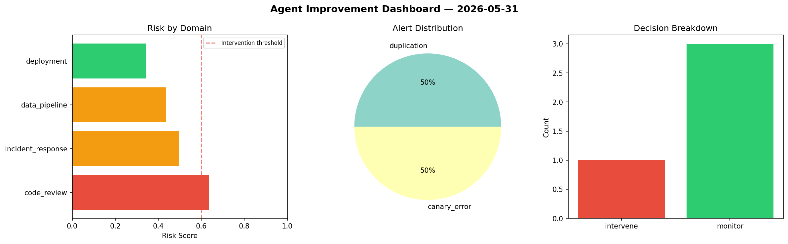
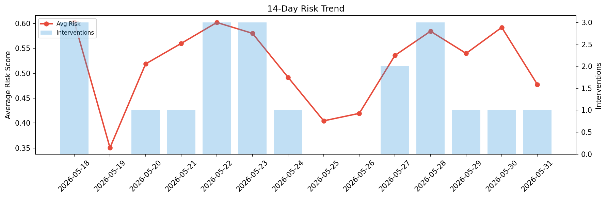

# Agent Improvement Report — 2026-05-31

**Cycle ID:** `3fae746e` | **Avg Risk:** 0.4774 | **Interventions:** 1/4

## Risk Matrix

| Domain | Risk Score | Decision | Alerts |
|--------|-----------|----------|--------|
| code_review | 0.6356 | intervene | duplication |
| incident_response | 0.4951 | monitor | none |
| data_pipeline | 0.437 | monitor | none |
| deployment | 0.3419 | monitor | canary_error |

## Delta vs Yesterday

| Domain | Today | Yesterday | Change |
|--------|-------|-----------|--------|
| code_review | 0.6356 | 0.5415 | 📈 17.4% |
| incident_response | 0.4951 | 0.4959 | 📉 -0.2% |
| data_pipeline | 0.437 | 0.7316 | 📉 -40.3% |
| deployment | 0.3419 | 0.5988 | 📉 -42.9% |

**Refinement:** `{'adjustment': 'maintain', 'trend': 'improving', 'window': 4}`