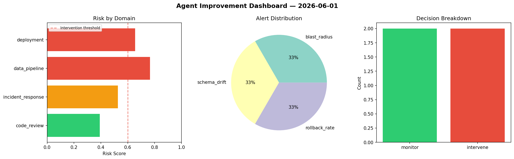
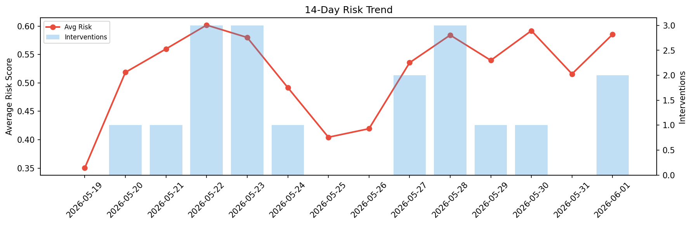

# Agent Improvement Report — 2026-06-01

**Cycle ID:** `ce89c8ee` | **Avg Risk:** 0.5854 | **Interventions:** 2/4

## Risk Matrix

| Domain | Risk Score | Decision | Alerts |
|--------|-----------|----------|--------|
| code_review | 0.3921 | monitor | none |
| incident_response | 0.5271 | monitor | blast_radius |
| data_pipeline | 0.7667 | intervene | schema_drift |
| deployment | 0.6558 | intervene | rollback_rate |

## Delta vs Yesterday

| Domain | Today | Yesterday | Change |
|--------|-------|-----------|--------|
| code_review | 0.3921 | 0.4996 | 📉 -21.5% |
| incident_response | 0.5271 | 0.5312 | 📉 -0.8% |
| data_pipeline | 0.7667 | 0.5778 | 📈 32.7% |
| deployment | 0.6558 | 0.4544 | 📈 44.3% |

**Refinement:** `{'adjustment': 'tighten_thresholds', 'trend': 'degrading', 'window': 4}`