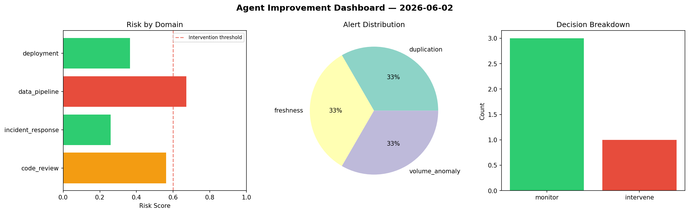
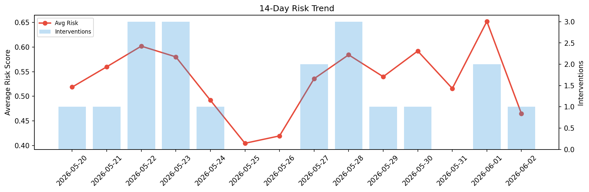

# Agent Improvement Report — 2026-06-02

**Cycle ID:** `9c2d970d` | **Avg Risk:** 0.4646 | **Interventions:** 1/4

## Risk Matrix

| Domain | Risk Score | Decision | Alerts |
|--------|-----------|----------|--------|
| code_review | 0.5623 | monitor | duplication |
| incident_response | 0.2589 | monitor | none |
| data_pipeline | 0.6726 | intervene | freshness, volume_anomaly |
| deployment | 0.3645 | monitor | none |

## Delta vs Yesterday

| Domain | Today | Yesterday | Change |
|--------|-------|-----------|--------|
| code_review | 0.5623 | 0.4306 | 📈 30.6% |
| incident_response | 0.2589 | 0.5386 | 📉 -51.9% |
| data_pipeline | 0.6726 | 0.9378 | 📉 -28.3% |
| deployment | 0.3645 | 0.7012 | 📉 -48.0% |

**Refinement:** `{'adjustment': 'maintain', 'trend': 'improving', 'window': 4}`