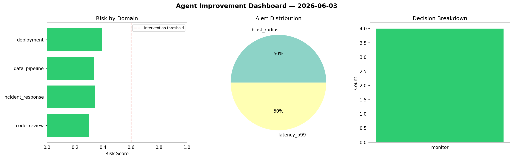
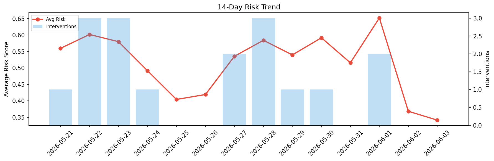

# Agent Improvement Report — 2026-06-03

**Cycle ID:** `bdfba577` | **Avg Risk:** 0.3415 | **Interventions:** 0/4

## Risk Matrix

| Domain | Risk Score | Decision | Alerts |
|--------|-----------|----------|--------|
| code_review | 0.2981 | monitor | none |
| incident_response | 0.3403 | monitor | blast_radius |
| data_pipeline | 0.3355 | monitor | none |
| deployment | 0.3919 | monitor | latency_p99 |

## Delta vs Yesterday

| Domain | Today | Yesterday | Change |
|--------|-------|-----------|--------|
| code_review | 0.2981 | 0.5123 | 📉 -41.8% |
| incident_response | 0.3403 | 0.2486 | 📈 36.9% |
| data_pipeline | 0.3355 | 0.2148 | 📈 56.2% |
| deployment | 0.3919 | 0.4982 | 📉 -21.3% |

**Refinement:** `{'adjustment': 'tighten_thresholds', 'trend': 'degrading', 'window': 4}`