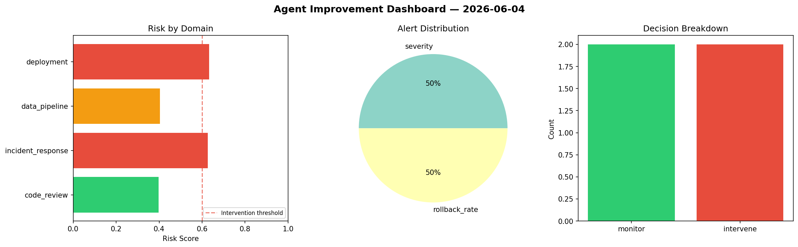
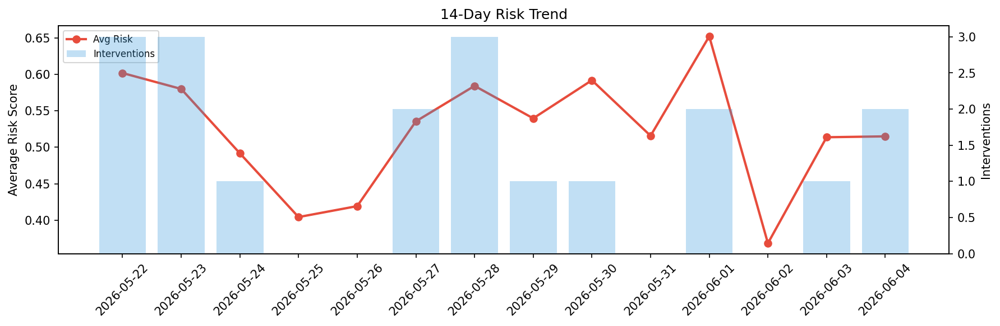

# Agent Improvement Report — 2026-06-04

**Cycle ID:** `07977c89` | **Avg Risk:** 0.515 | **Interventions:** 2/4

## Risk Matrix

| Domain | Risk Score | Decision | Alerts |
|--------|-----------|----------|--------|
| code_review | 0.397 | monitor | none |
| incident_response | 0.6263 | intervene | severity |
| data_pipeline | 0.4046 | monitor | none |
| deployment | 0.6322 | intervene | rollback_rate |

## Delta vs Yesterday

| Domain | Today | Yesterday | Change |
|--------|-------|-----------|--------|
| code_review | 0.397 | 0.6773 | 📉 -41.4% |
| incident_response | 0.6263 | 0.5807 | 📈 7.9% |
| data_pipeline | 0.4046 | 0.3296 | 📈 22.8% |
| deployment | 0.6322 | 0.4677 | 📈 35.2% |

**Refinement:** `{'adjustment': 'tighten_thresholds', 'trend': 'degrading', 'window': 4}`