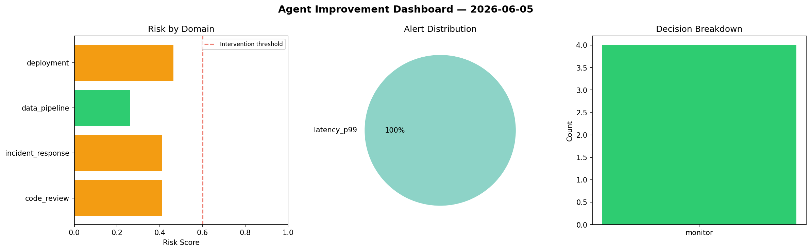
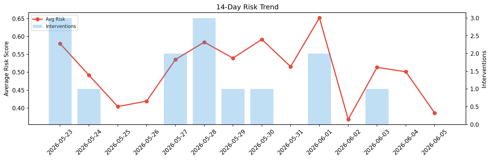

# Agent Improvement Report — 2026-06-05

**Cycle ID:** `8b1b2259` | **Avg Risk:** 0.3864 | **Interventions:** 0/4

## Risk Matrix

| Domain | Risk Score | Decision | Alerts |
|--------|-----------|----------|--------|
| code_review | 0.4111 | monitor | none |
| incident_response | 0.41 | monitor | none |
| data_pipeline | 0.2613 | monitor | none |
| deployment | 0.4631 | monitor | latency_p99 |

## Delta vs Yesterday

| Domain | Today | Yesterday | Change |
|--------|-------|-----------|--------|
| code_review | 0.4111 | 0.4616 | 📉 -10.9% |
| incident_response | 0.41 | 0.4986 | 📉 -17.8% |
| data_pipeline | 0.2613 | 0.535 | 📉 -51.2% |
| deployment | 0.4631 | 0.5107 | 📉 -9.3% |

**Refinement:** `{'adjustment': 'tighten_thresholds', 'trend': 'degrading', 'window': 4}`