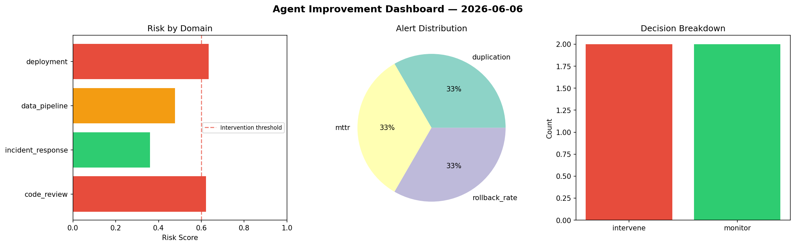
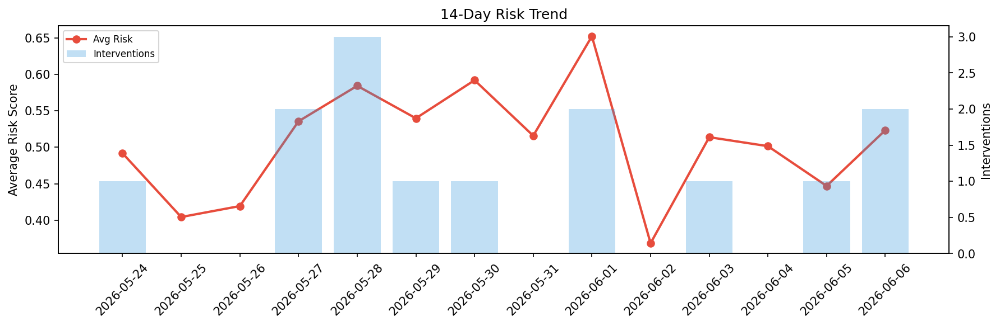

# Agent Improvement Report — 2026-06-06

**Cycle ID:** `ff2ed9df` | **Avg Risk:** 0.5233 | **Interventions:** 2/4

## Risk Matrix

| Domain | Risk Score | Decision | Alerts |
|--------|-----------|----------|--------|
| code_review | 0.6222 | intervene | duplication |
| incident_response | 0.3604 | monitor | mttr |
| data_pipeline | 0.4766 | monitor | none |
| deployment | 0.6339 | intervene | rollback_rate |

## Delta vs Yesterday

| Domain | Today | Yesterday | Change |
|--------|-------|-----------|--------|
| code_review | 0.6222 | 0.573 | 📈 8.6% |
| incident_response | 0.3604 | 0.6638 | 📉 -45.7% |
| data_pipeline | 0.4766 | 0.1652 | 📈 188.5% |
| deployment | 0.6339 | 0.386 | 📈 64.2% |

**Refinement:** `{'adjustment': 'tighten_thresholds', 'trend': 'degrading', 'window': 4}`