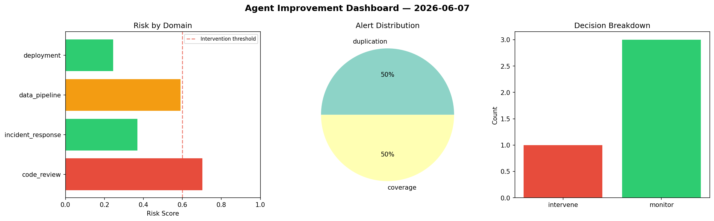
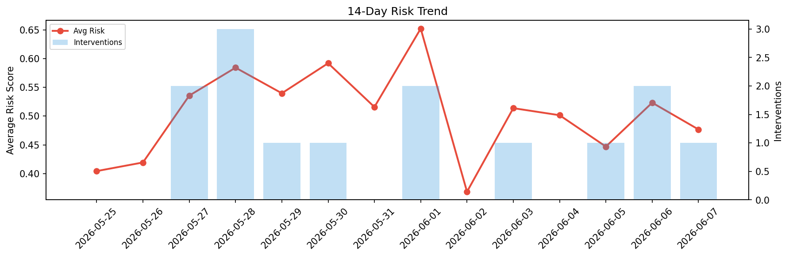

# Agent Improvement Report — 2026-06-07

**Cycle ID:** `f4c287b6` | **Avg Risk:** 0.4768 | **Interventions:** 1/4

## Risk Matrix

| Domain | Risk Score | Decision | Alerts |
|--------|-----------|----------|--------|
| code_review | 0.7022 | intervene | duplication, coverage |
| incident_response | 0.3692 | monitor | none |
| data_pipeline | 0.5908 | monitor | none |
| deployment | 0.2449 | monitor | none |

## Delta vs Yesterday

| Domain | Today | Yesterday | Change |
|--------|-------|-----------|--------|
| code_review | 0.7022 | 0.6222 | 📈 12.9% |
| incident_response | 0.3692 | 0.3604 | 📈 2.4% |
| data_pipeline | 0.5908 | 0.4766 | 📈 24.0% |
| deployment | 0.2449 | 0.6339 | 📉 -61.4% |

**Refinement:** `{'adjustment': 'maintain', 'trend': 'improving', 'window': 4}`