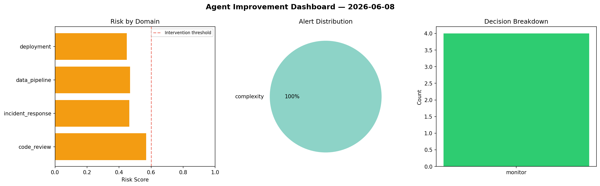
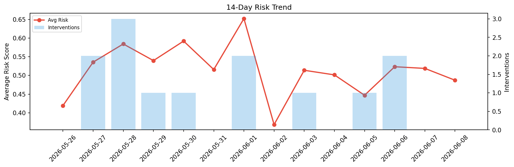

# Agent Improvement Report — 2026-06-08

**Cycle ID:** `2603a0c5` | **Avg Risk:** 0.4872 | **Interventions:** 0/4

## Risk Matrix

| Domain | Risk Score | Decision | Alerts |
|--------|-----------|----------|--------|
| code_review | 0.5687 | monitor | complexity |
| incident_response | 0.4639 | monitor | none |
| data_pipeline | 0.4685 | monitor | none |
| deployment | 0.4476 | monitor | none |

## Delta vs Yesterday

| Domain | Today | Yesterday | Change |
|--------|-------|-----------|--------|
| code_review | 0.5687 | 0.5354 | 📈 6.2% |
| incident_response | 0.4639 | 0.5405 | 📉 -14.2% |
| data_pipeline | 0.4685 | 0.5853 | 📉 -20.0% |
| deployment | 0.4476 | 0.4139 | 📈 8.1% |

**Refinement:** `{'adjustment': 'maintain', 'trend': 'improving', 'window': 4}`