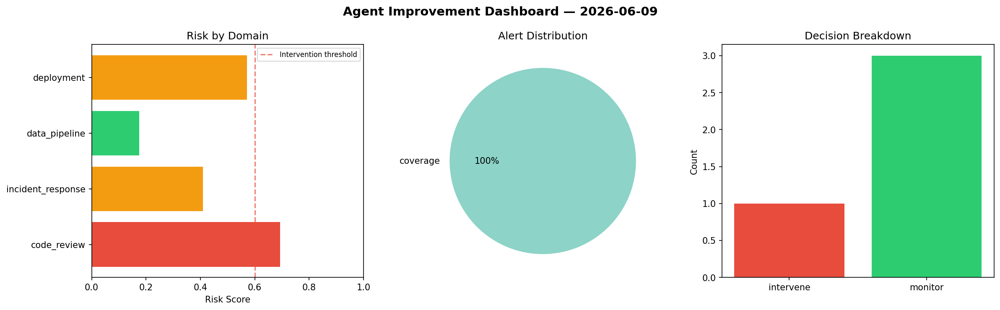
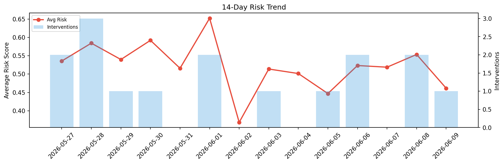

# Agent Improvement Report — 2026-06-09

**Cycle ID:** `b75264f5` | **Avg Risk:** 0.4615 | **Interventions:** 1/4

## Risk Matrix

| Domain | Risk Score | Decision | Alerts |
|--------|-----------|----------|--------|
| code_review | 0.6923 | intervene | coverage |
| incident_response | 0.4086 | monitor | none |
| data_pipeline | 0.1745 | monitor | none |
| deployment | 0.5707 | monitor | none |

## Delta vs Yesterday

| Domain | Today | Yesterday | Change |
|--------|-------|-----------|--------|
| code_review | 0.6923 | 0.2874 | 📈 140.9% |
| incident_response | 0.4086 | 0.7997 | 📉 -48.9% |
| data_pipeline | 0.1745 | 0.4761 | 📉 -63.3% |
| deployment | 0.5707 | 0.6502 | 📉 -12.2% |

**Refinement:** `{'adjustment': 'maintain', 'trend': 'improving', 'window': 4}`