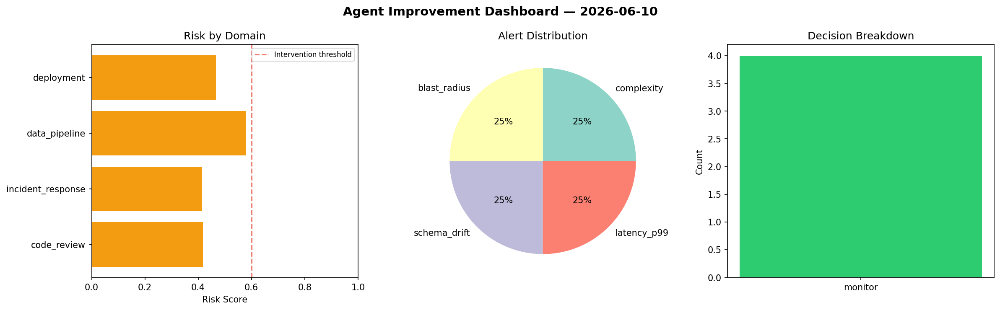
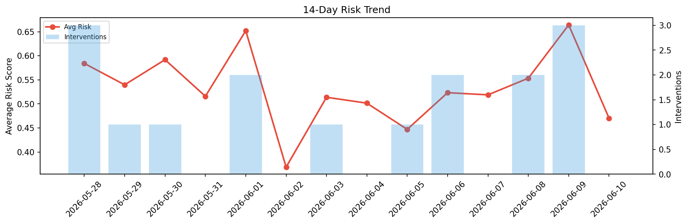

# Agent Improvement Report — 2026-06-10

**Cycle ID:** `ade8cc36` | **Avg Risk:** 0.4702 | **Interventions:** 0/4

## Risk Matrix

| Domain | Risk Score | Decision | Alerts |
|--------|-----------|----------|--------|
| code_review | 0.4183 | monitor | complexity |
| incident_response | 0.4153 | monitor | blast_radius |
| data_pipeline | 0.5802 | monitor | schema_drift |
| deployment | 0.4669 | monitor | latency_p99 |

## Delta vs Yesterday

| Domain | Today | Yesterday | Change |
|--------|-------|-----------|--------|
| code_review | 0.4183 | 0.6859 | 📉 -39.0% |
| incident_response | 0.4153 | 0.4449 | 📉 -6.7% |
| data_pipeline | 0.5802 | 0.7099 | 📉 -18.3% |
| deployment | 0.4669 | 0.816 | 📉 -42.8% |

**Refinement:** `{'adjustment': 'tighten_thresholds', 'trend': 'degrading', 'window': 4}`