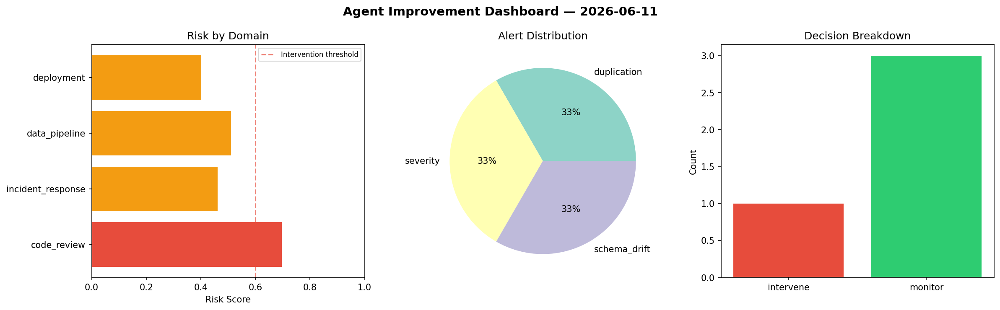
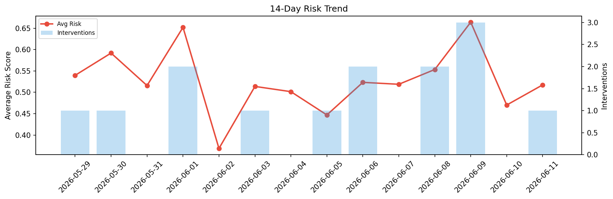

# Agent Improvement Report — 2026-06-11

**Cycle ID:** `ab877cad` | **Avg Risk:** 0.5174 | **Interventions:** 1/4

## Risk Matrix

| Domain | Risk Score | Decision | Alerts |
|--------|-----------|----------|--------|
| code_review | 0.6967 | intervene | duplication |
| incident_response | 0.4609 | monitor | severity |
| data_pipeline | 0.5103 | monitor | schema_drift |
| deployment | 0.4017 | monitor | none |

## Delta vs Yesterday

| Domain | Today | Yesterday | Change |
|--------|-------|-----------|--------|
| code_review | 0.6967 | 0.4183 | 📈 66.6% |
| incident_response | 0.4609 | 0.4153 | 📈 11.0% |
| data_pipeline | 0.5103 | 0.5802 | 📉 -12.0% |
| deployment | 0.4017 | 0.4669 | 📉 -14.0% |

**Refinement:** `{'adjustment': 'maintain', 'trend': 'improving', 'window': 4}`