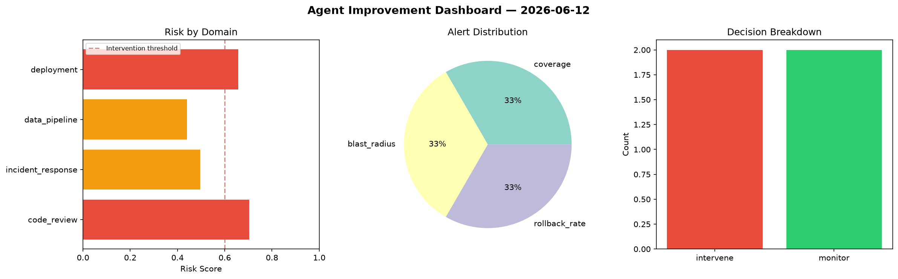
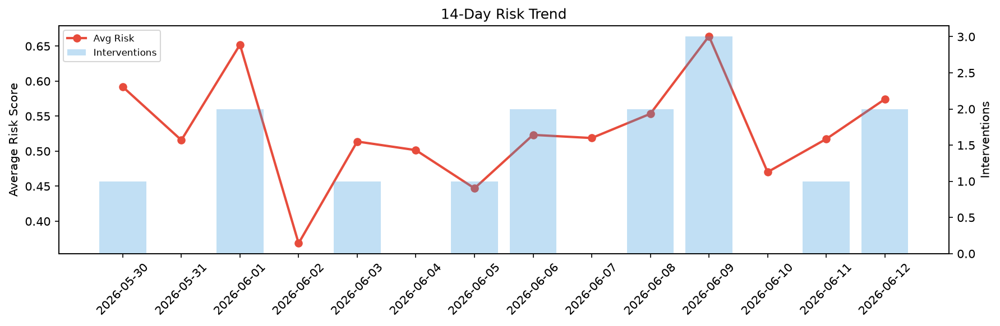

# Agent Improvement Report — 2026-06-12

**Cycle ID:** `7f508d0a` | **Avg Risk:** 0.5742 | **Interventions:** 2/4

## Risk Matrix

| Domain | Risk Score | Decision | Alerts |
|--------|-----------|----------|--------|
| code_review | 0.703 | intervene | coverage |
| incident_response | 0.4961 | monitor | blast_radius |
| data_pipeline | 0.4407 | monitor | none |
| deployment | 0.657 | intervene | rollback_rate |

## Delta vs Yesterday

| Domain | Today | Yesterday | Change |
|--------|-------|-----------|--------|
| code_review | 0.703 | 0.6967 | 📈 0.9% |
| incident_response | 0.4961 | 0.4609 | 📈 7.6% |
| data_pipeline | 0.4407 | 0.5103 | 📉 -13.6% |
| deployment | 0.657 | 0.4017 | 📈 63.6% |

**Refinement:** `{'adjustment': 'maintain', 'trend': 'improving', 'window': 4}`