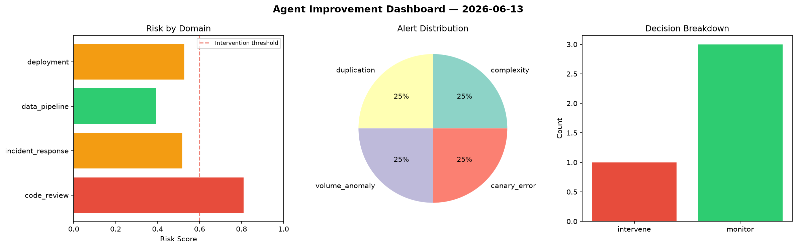
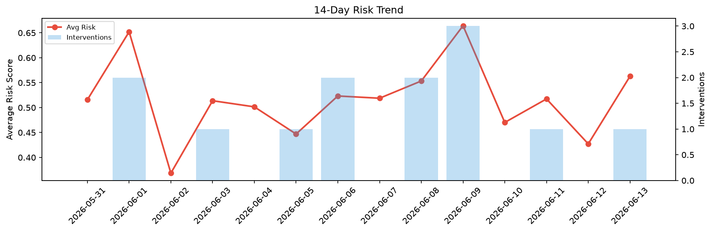

# Agent Improvement Report — 2026-06-13

**Cycle ID:** `ed64357f` | **Avg Risk:** 0.5628 | **Interventions:** 1/4

## Risk Matrix

| Domain | Risk Score | Decision | Alerts |
|--------|-----------|----------|--------|
| code_review | 0.8102 | intervene | complexity, duplication |
| incident_response | 0.5188 | monitor | none |
| data_pipeline | 0.3941 | monitor | volume_anomaly |
| deployment | 0.528 | monitor | canary_error |

## Delta vs Yesterday

| Domain | Today | Yesterday | Change |
|--------|-------|-----------|--------|
| code_review | 0.8102 | 0.279 | 📈 190.4% |
| incident_response | 0.5188 | 0.5868 | 📉 -11.6% |
| data_pipeline | 0.3941 | 0.3294 | 📈 19.6% |
| deployment | 0.528 | 0.5135 | 📈 2.8% |

**Refinement:** `{'adjustment': 'maintain', 'trend': 'improving', 'window': 4}`