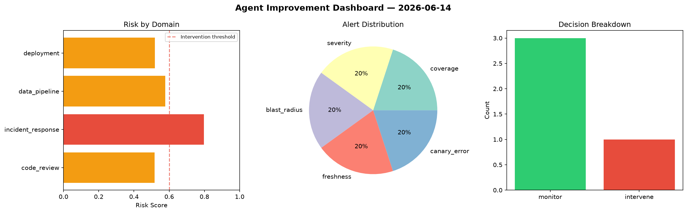
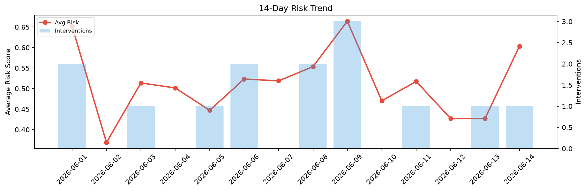

# Agent Improvement Report — 2026-06-14

**Cycle ID:** `cb7a59f0` | **Avg Risk:** 0.603 | **Interventions:** 1/4

## Risk Matrix

| Domain | Risk Score | Decision | Alerts |
|--------|-----------|----------|--------|
| code_review | 0.5178 | monitor | coverage |
| incident_response | 0.7975 | intervene | severity, blast_radius |
| data_pipeline | 0.5782 | monitor | freshness |
| deployment | 0.5183 | monitor | canary_error |

## Delta vs Yesterday

| Domain | Today | Yesterday | Change |
|--------|-------|-----------|--------|
| code_review | 0.5178 | 0.3722 | 📈 39.1% |
| incident_response | 0.7975 | 0.2836 | 📈 181.2% |
| data_pipeline | 0.5782 | 0.6303 | 📉 -8.3% |
| deployment | 0.5183 | 0.4221 | 📈 22.8% |

**Refinement:** `{'adjustment': 'tighten_thresholds', 'trend': 'degrading', 'window': 4}`